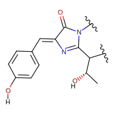
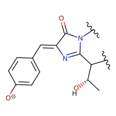
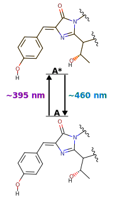
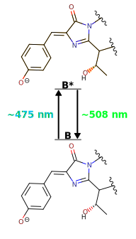
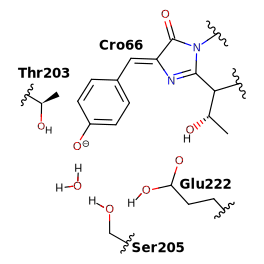

# Fluorescence mechanism

The fluorescence mechanism in enhanced Green Fluorescent Protein (eGFP) is a complex interplay of photophysical and photochemical processes that occur at the molecular level.
This section delves into the current understanding of fluorescence in eGFP, exploring the fundamental principles of excitation and de-excitation, as well as the various factors that influence these processes.
We will examine how the protein environment modulates the fluorescent properties, the critical role of chromophore protonation states, and the intricate dynamics of excited-state phenomena such as non-adiabatic crossings and proton transfer.

!!! note
    From this point forward, we will refer to eGFP as "GFP" and eGFP chromophore [^cormack1996facs] as "chromophore" that is the result of the Ser65, Tyr66, and Gly67 mutations from the  *Aequorea victoria* wild type GFP [^prasher1992primary].

## Chromophore

The fluorescence cycle in GFP begins with the absorption of a photon by the chromophore, typically in the blue region of the visible spectrum (around 488 nm).
This absorption process is intimately linked to the unique molecular structure of the chromophore.
The chromophore is formed autocatalytically from three amino acid residues&mdash;Ser65, Tyr66, and Gly67&mdash;through a series of reactions involving cyclization, dehydration, and oxidation.
The resulting structure consists of a hydroxybenzylidene imidazolinone moiety, which forms an extended $\pi$-conjugated system.

!!! quote "Figure"
    <figure markdown>
    { width=300 }
    </figure>

    Depicts the chemical structure of the GFP chromophore.

### Excitation

This π-conjugated system is crucial for the chromophore's light-absorbing properties.
The delocalized electrons in the conjugated bonds can be excited by photons of specific energies, corresponding to the energy gap between the ground state ($S_0$) and the first excited state ($S_1$) of the chromophore.
The exact absorption wavelength is fine-tuned by several factors (discussed later): planarity, protonation state, and protein environment.

When a blue photon is absorbed, it promotes an electron from the highest occupied molecular orbital (HOMO) to the lowest unoccupied molecular orbital (LUMO) of the chromophore.
This electronic transition is predominantly π → π* in nature, reflecting the excitation within the π-conjugated system.

Following absorption, the excited chromophore undergoes rapid vibrational relaxation within the $S_1$ state, typically on a femtosecond to picosecond timescale.
This relaxation involves small structural adjustments in the chromophore and its immediate protein environment, preparing the system for the subsequent fluorescence emission.

!!! quote "Figure"
    <figure markdown>
    { width=600 }
    </figure>

    TODO:

### Protonation states

The protonation state of the GFP chromophore is a critical determinant of its photophysical properties, playing a crucial role in the protein's spectral characteristics and fluorescence behavior.
The chromophore can exist in two primary forms: a neutral (protonated) state and an anionic (deprotonated) state, each exhibiting distinct spectroscopic signatures.

In its neutral form, the chromophore's phenolic oxygen is protonated, resulting in an absorption maximum typically around 395-400 nm.

!!! quote "Figure"
    <figure markdown>
    { width=300 }
    </figure>

This state is often referred to as the A state.
The neutral chromophore generally exhibits weaker fluorescence compared to its anionic counterpart, with emission maxima around 460 nm.
The reduced fluorescence efficiency of the neutral form is attributed to excited-state dynamics that favor non-radiative decay pathways.

The anionic form of the chromophore, where the phenolic oxygen is deprotonated, is primarily responsible for the characteristic green fluorescence of GFP.

!!! quote "Figure"
    <figure markdown>
    { width=300 }
    </figure>

This state, often called the B state, has an absorption maximum at approximately 475-490 nm and emits strongly at around 510 nm.
The anionic chromophore demonstrates a higher fluorescence quantum yield, making it the predominant contributor to GFP's bright fluorescence.

The relative population of these two states is influenced by several factors, including the local pH, specific interactions within the protein environment, and mutations in the protein sequence.
In wild-type GFP, the chromophore exists in an equilibrium between these two states, with the population distribution heavily dependent on pH.
Under physiological conditions, the anionic form is typically favored.

### Planarity

The planarity of the eGFP chromophore plays a pivotal role in determining its fluorescent properties, particularly through enhanced conjugation and increased quantum yield.
These factors contribute significantly to the chromophore's spectroscopic characteristics and efficiency.

Enhanced conjugation in a planar chromophore structure is primarily due to the maximized overlap of p-orbitals in the π-conjugated system.
This optimal alignment of p-orbitals, perpendicular to the molecular plane, facilitates efficient delocalization of π-electrons across the entire conjugated system.
Such extensive electron delocalization has profound effects on the chromophore's electronic structure, most notably in reducing the energy gap between the Highest Occupied Molecular Orbital (HOMO) and the Lowest Unoccupied Molecular Orbital (LUMO).

The consequence of this reduced HOMO-LUMO gap is a red-shift in both absorption and emission spectra.
As the energy required for electronic transitions decreases, the chromophore absorbs and emits light at longer wavelengths.
This spectral shift is a direct result of the enhanced conjugation afforded by the planar structure.
Moreover, the planar configuration typically leads to higher oscillator strengths for electronic transitions, potentially resulting in stronger absorption and brighter fluorescence.

Planarity also significantly impacts the chromophore's quantum yield by restricting non-radiative decay pathways.
In non-planar configurations, rotation around single bonds, can serve as an efficient route for non-radiative decay.
However, when the chromophore is held in a planar conformation by the protein environment, these rotational movements are severely limited.
This restriction of molecular motion creates energy barriers in the excited state potential energy surface, effectively preventing the chromophore from accessing geometries that favor non-radiative decay.

Furthermore, the planar structure reduces coupling between electronic and vibrational states, which might otherwise lead to non-radiative relaxation through internal conversion.
The minimized structural changes between ground and excited states in a planar chromophore also contribute to reduced internal conversion rates.
Consequently, with fewer available non-radiative pathways, the excited chromophore is more likely to return to the ground state via fluorescence emission, directly increasing the fluorescence quantum yield.

## Emissions

TODO:

### Protonated only

TODO:

!!! quote "Figure"
    <figure markdown>
    { width=300 }
    </figure>

### Deprotonated only

TODO:

!!! quote "Figure"
    <figure markdown>
    { width=300 }
    </figure>

TODO:

!!! quote "Figure"
    <figure markdown>
    { width=300 }
    </figure>

### Photocycle

TODO:

!!! quote "Figure"
    <figure markdown>
    { width=500 }
    </figure>

<!-- REFERENCES -->

[^cormack1996facs]: Cormack, B. P., Valdivia, R. H., & Falkow, S. (1996). FACS-optimized mutants of the green fluorescent protein (GFP). Gene, 173(1), 33-38. DOI: [10.1016/0378-1119(95)00685-0](https://doi.org/10.1016/0378-1119(95)00685-0)
[^prasher1992primary]: Prasher, D. C., Eckenrode, V. K., Ward, W. W., Prendergast, F. G., & Cormier, M. J. (1992). Primary structure of the Aequorea victoria green-fluorescent protein. Gene, 111(2), 229-233. DOI: [10.1016/0378-1119(92)90691-H](https://doi.org/10.1016/0378-1119(92)90691-H)
