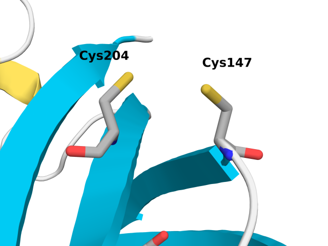
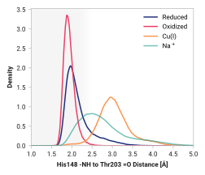
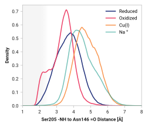
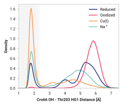

# R003 - Cu(I) binding mechanism of roGFP2

This report proposes molecular mechanisms of Cu(I) binding to roGFP2 [^hanson2004investigating].

## Interpreting roGFP2 fluorescence

roGFP2 contains mutations creating a redox-sensitive pair of Cystines at position 147 and 204 in eGFP [^hanson2004investigating].

!!! quote "Figure 1: Graphical representation of pertinent eGFP mutations for roGFP2."

    <figure markdown>
    { width=700 }
    </figure>

Oxidized roGFP2 exhibits a distinct shift in A- and B-band absorption [^hanson2004investigating].

!!! quote "Figure 2: roGFP2 florescence in response to oxidizing environments."
    <figure markdown>
    { width=400 }
    </figure>

    Relative fluorescence at 511 nm after excitation scan from 350 to 500 nm at -0.310 (blue), -0.275 (green), and -0.240 V (orange) redox potentials.
    Adapted from Hanson et al [^hanson2004investigating].

### A-band

A-band absorbance at around 400 nm with subsequent 511 nm fluorescence primarily indicates the canonical GFP photocycle shown in Figure 3.

???+ warning
    The exact wavelengths vary between GFP constructs; numbers provided here offer practical guidelines.

!!! quote "Figure 3: GFP photocycle following A-band excitation."
    <figure markdown>
    { width=500 }
    </figure>

    This process involves the initial excitation of the neutral (protonated) chromophore, followed by rapid, successive proton transfer events in the excited state, ultimately resulting in emission from the anionic chromophore.

### B-band

B-band absorption represents excitation of the anionic chromophore.
All aforementioned changes in the A band could also complementary impact the B band.

!!! quote "Figure 4: GFP photocycle following A-band excitation."
    <figure markdown>
    { width=250 }
    </figure>

### Perturbations

Changes in A- or B-band absorption could indicate a variety of environmental changes in the chromophore.

-   **Equilibrium ratio of A or B state populations.**
    Changes in neutral (A state) or anionic (B state) chromophore stability impacts the relative proportion of A- and B-band absorbance.
    For example, roGFP1 [^hanson2004investigating] has a higher A band instead of B band.
    A-state stability would be directly correlated to A-band fluorescence; whereas the B band would be inversely correlated.
-   **Excited-state proton transfer (ESPT) from A\* &rarr; I\*.**
    Emissions at the typical 511 nm (green) fluorescence from the A state requires an ESPT from Cro66 to Glu222 through a coordinated water molecule and Ser205.
    Prohibiting ESPT would result in radiative emission at ~460 nm which often is not monitored.
-   **Ground-state proton transfer (GSPT) from I &rarr; A.**
    Reprotonating the chromophore through a GSPT is crucial for maintaining the A band and B-band lifetime.
    Disrupting the Glu222 &rarr; Ser205, Ser205 &rarr; H2O, or H2O &rarr; Cro66 pathway would decrease the A-state population&mdash;likely with a corresponding B state increase.

## Fluorescence mechanism of Cu(I) distinct from oxidation

Several experiments were performed to probe the fluorescence mechanism and binding affinity of Cu(I) to roGFP2.
Our focus here is to elucidate the distinct Cu(I) atomistic mechanism from the oxidized state.
Figure 5 shows the fluorescence of roGFP2 under various conditions.

!!! quote "Figure 5: Cu(I) fluorescence mechanism is distinct from oxidization."
    <figure markdown>
    { width=600 }
    </figure>

    Relative fluorescence (measured 528 nm emissions) of roGFP2 under reduced, oxidized, and Cu(I) conditions from 380 to 500 nm excitation scan.
    (TODO: Check emission value?)
    **Apo** (i.e., reduced) roGFP2 exhibits typical bimodal absorption of A-band (excited at 400 nm) and B-band (excited at 488) peaks.
    Upon roGFP2 **oxidation** from 1 mM H2O2, a shift in A- (increased) and B-band (decreased) absorption and subsequent 528 nm emission marks a corresponding change in neutral and anionic chromophore populations.
    Binding of **Cu(I)**, however, exhibits a larger decrease in B-band without the A-band increase observed when oxidized.

First, we see a distinct difference from reduced &rarr; oxidized and reduced &rarr; Cu(I).
Oxidized roGFP2 results in a (1) enhanced A band and (2) slight decrease in the B band.
However, Cu(I) binding dramatically reduces the B band without change in the A band.
This indicates that Cu(I) binding affects the chromophore differently than oxidation.

## Cu(I) binding enhances roGFP2 backbone flexibility

First, we investigate the structural dynamics of Cys147 and Cys204 interactions by analyzing the C$_\alpha$-C$_\alpha$ distances.
Experimental structures of both the reduced (PDB ID: [1JC0](https://www.rcsb.org/structure/1JC0)) and oxidized (PDB ID: [1JC1](https://www.rcsb.org/structure/1JC1)) states of for roGFP2 exhibited a mean C$_\alpha$-C$_\alpha$ distance of 4.30 ± 0.12 and 4.07 ± 0.09, respectively. [^hanson2004investigating]
Our MD simulations agreed well with experimental observations as shown in Table 1.

!!! quote "Table 1: C$_\alpha$-C$_\alpha$ distance mean ± 2$\sigma$."
    | State | Experimental (Å) | MD simulations (Å) |
    | ----- | ------------ | -------------- |
    | **Reduced** | 4.30 ± 0.12 | 4.34 ± 0.47 |
    | **Oxidized** | 4.07 ± 0.09 | 4.11 ± 0.29 |
    | **Cu(I)** | N/A | 4.78 ± 0.82 |

Larger standard deviations, $\sigma$, would be expected for molecular simulations due to capturing the dynamic fluctuations in solution.
Figure 6 shows the observed distribution of C$_\alpha$-C$_\alpha$ distances.

!!! quote "Figure 6: C$_\alpha$-C$_\alpha$ distance probability density."
    <figure markdown>
    { width=700 }
    </figure>

    For more figure information, go [here](../../../figures/b-cys/b004-cys147_ca-cys204_ca/).

Cu(I) binding to Cys147 and Cys204 in roGFP2 induces significant structural changes, particularly in the protein's conformation.
The observed increase in the C$_\alpha$-C$_\alpha$ distance from approximately 4.3 Å to a broader distribution centered around 4.48 Å and 4.96 Å indicates a marked increase in conformational flexibility.

Cys147 is located near the C-terminus end of a $\beta$-pleaded sheet between His148 and Thr203.
(Figure 7 illustrates the key residues in roGFP2 mechanism.)

!!! quote "Figure 7: Relevant residues in roGFP2 mechanism."
    <figure markdown>
    { width=700 }
    </figure>

We observe in Figure 8 that Cu(I) binding breaks this $\beta$-sheet hydrogen bond.

???+ info

    A hydrogen bond of X&ndash;H $\cdots$ Y&ndash;Z, where X is the donor and Y is the acceptor atom, can be classified based on distances and angles.
    One characteristic recommended by IUPAC is that the H $\cdots$ Y distance is less than the sum of H and Y van der Waals radii.
    Hydrogen (1.10 Å) and oxygen (1.52 Å) [^mantina2009consistent] would have a cutoff of 2.62 Å.
    Others recommend a cutoff of 2.50 Å [^hubbard2010hydrogen] based on structural analysis [^mcdonald1994satisfying] and quantum chemical calculations [^liu2008geometrical].
    Since the difference between a 2.5 and 2.62 Å cutoff is likely a substantially weak hydrogen bond, we will use **a H $\cdots$ Y cutoff of 2.5 Å**.

In fact, Table 2 shows that the hydrogen bond probability ( &ndash;NH to O= within 2.5 Å) decreases from 0.865 (reduced) to 0.063 in Cu(I) simulations.

!!! quote "Figure 8: Probability of observing a backbone hydrogen bond between His148 and Thr203."
    <figure markdown>
    { width=700 }
    </figure>

    Probability density of H to O distance between His148 amino to Thr203 carboxyl groups

!!! quote "Table 2: Probability of His148 - Thr203 backbone hydrogen bond."

    | System | H bond |
    | ------ | ------ |
    | Reduced | 0.865 |
    | Oxidized | 0.997 |
    | Cu(I) | 0.063 |

Parallel results are observed on the other side of Cys147&mdash;between Asn146 and Ser205.

!!! quote "Figure 9: Probability of observing a backbone hydrogen bond between Asn147 and Ser205."
    <figure markdown>
    { width=700 }
    </figure>

!!! quote "Table 3: Probability of Asn146 - Ser205 backbone hydrogen bond."

    | System | H bond |
    | ------ | ------ |
    | Reduced | 0.047 |
    | Oxidized | 0.144 |
    | Cu(I) | 0.000 |

## Perturbations in anionic chromophore stability

!!! quote "Figure 9A: PMF of Cro66 stabilization through Tyr145 and His148 in **reduced** simulations."
    <figure markdown>
    { width=700 }
    </figure>

!!! quote "Figure 9B: PMF of Cro66 stabilization through Tyr145 and His148 in **oxidized** simulations."
    <figure markdown>
    { width=700 }
    </figure>

!!! quote "Figure 9C: PMF of Cro66 stabilization through Tyr145 and His148 in **Cu(I)** simulations."
    <figure markdown>
    { width=700 }
    </figure>

!!! quote "Figure 10: "
    <figure markdown>
    { width=700 }
    </figure>

## Disruption of ground-state proton transfer

!!! quote "Figure 11"
    <figure markdown>
    { width=700 }
    </figure>

<!-- References -->

[^hanson2004investigating]: Hanson, G. T., Aggeler, R., Oglesbee, D., Cannon, M., Capaldi, R. A., Tsien, R. Y., & Remington, S. J. (2004). Investigating mitochondrial redox potential with redox-sensitive green fluorescent protein indicators. Journal of Biological Chemistry, 279(13), 13044-13053. DOI: [10.1074/jbc.M312846200](https://doi.org/10.1074/jbc.M312846200)

[^mantina2009consistent]: Mantina, M., Chamberlin, A. C., Valero, R., Cramer, C. J., & Truhlar, D. G. (2009). Consistent van der Waals radii for the whole main group. *Journal of Physical Chemistry A, 113*(19), 5806-5812.
[^hubbard2010hydrogen]: Hubbard, R. E., & Haider, M. K. (2010). Hydrogen bonds in proteins: role and strength. *Encyclopedia of life sciences*, 1, 1-6.
[^mcdonald1994satisfying]: McDonald, I. K., & Thornton, J. M. (1994). Satisfying hydrogen bonding potential in proteins. *Journal of molecular biology, 238*(5), 777-793.
[^liu2008geometrical]: Liu, Z., Wang, G., Li, Z., & Wang, R. (2008). Geometrical Preferences of the Hydrogen Bonds on Protein− Ligand Binding Interface Derived from Statistical Surveys and Quantum Mechanics Calculations. *Journal of Chemical Theory and Computation, 4*(11), 1959-1973.
