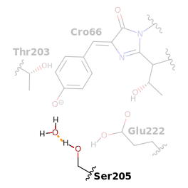
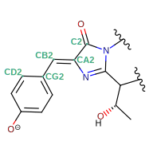

# R002 - Molecular simulations

We performed classical molecular dynamics (MD) simulations of roGFP2 [^hanson2004investigating] with

-   the anionic chromophore in the ground state;
-   neutral and anionic Glu222.

roGFP2 is derived from enhanced GFP (eGFP; S65T and F64L mutations) with S147C and Q204C mutations.
These simulations allow us to probe the affect of roGFP2 oxidation and Cu(I) binding of Cys147 and 204.
We performed the following three sets of simulations.

=== "Reduced"

    Cys147 and Cys204 remain in their reduced (i.e., protonated) form.

    <figure markdown>
    { width=500 }
    </figure>

=== "Oxidized"

    Disulfide bridge between Cys147 and Cys204.

    <figure markdown>
    { width=500 }
    </figure>

=== "Copper"

    Reduced Cys147 and Cys204 with a coordinated Cu(I).

    <figure markdown>
    { width=500 }
    </figure>

Differences between reduced and oxidized states are indicative of the canonical roGFP2 atomistic mechanism.
If we observe similar differences between reduced and copper states, this would suggest a similar mechanism as the oxidized state; however, deviations between oxidized and copper would suggest a separate mechanism.

## Cysteine conformations

We first investigate the structural dynamics of Cys147 and Cys204 interactions by analyzing the C$_\alpha$-C$_\alpha$ distances.

!!! quote "Alpha carbon distances between roGFP2 cysteines."
    For more figure information, go [here](../../../figures/f-cys-beta/f008-cys147_ca-cys204_ca/).

    <figure markdown>
    { width=500 }
    </figure>

As one would expect, formation of the disulfide bridge in the oxidized state induces a highly strained conformation of around 3.93 Å C$_\alpha$-C$_\alpha$ distance, agreeing with the average experimental distance of 4.04 $\pm$ 0.09 Å [^hanson2004investigating].
However, 

## Photocycle reprotonation

The last step of the [canonical photocycle](../fluorescence-mechanism/#photocycle) is reprotonation of of anionic chromophore through a GLU222, SER205, WAT, and finally CRO66 proton wire.
Intermolecular distances distances between each chemical species is a common feature to describe potential proton transfers in MD simulations.

### GLH222 to SER205

!!! quote "Figure X. Illustration of GLH222 to SER205 distance."
    <figure markdown>
    { width=500 }
    </figure>

!!! quote "Figure X. Probability density of GLH222 to SER205 proton transfer."
    <figure markdown>
    { width=500 }
    </figure>

### SER205 to WAT

!!! quote "Figure X. Illustration of SER205 to WAT distance."
    <figure markdown>
    { width=500 }
    </figure>

!!! quote "Figure X. Probability density of SER205 to WAT proton transfer."
    <figure markdown>
    { width=500 }
    </figure>

### WAT to CRO66

!!! quote "Figure X. Illustration of WAT to CRO distance."
    <figure markdown>
    { width=500 }
    </figure>

!!! quote "Figure X. Probability density of WAT to CRO66 proton transfer."
    <figure markdown>
    { width=500 }
    </figure>

## B-state stabilization

TODO:

!!! quote "Figure X. Probability density of THR203 to CRO66 hydrogen bonding in GLH222 simulations."
    <figure markdown>
    { width=500 }
    </figure>

!!! quote "Figure X. Probability density of THR203 to CRO66 hydrogen bonding in GLH222 simulations."
    <figure markdown>
    { width=500 }
    </figure>

### Deprotonated GLU

!!! quote "Figure X. Probability density of THR203 to CRO66 hydrogen bonding in GLU222 simulations."
    <figure markdown>
    { width=500 }
    </figure>

## Non-adiabatic crossings

!!! quote "Figure X."
    <figure markdown>
    { width=500 }
    </figure>

!!! quote "Figure X."
    <figure markdown>
    { width=500 }
    </figure>

!!! quote "Figure X."
    <figure markdown>
    { width=500 }
    </figure>

<!-- References -->

[^hanson2004investigating]: Hanson, G. T., Aggeler, R., Oglesbee, D., Cannon, M., Capaldi, R. A., Tsien, R. Y., & Remington, S. J. (2004). Investigating mitochondrial redox potential with redox-sensitive green fluorescent protein indicators. Journal of Biological Chemistry, 279(13), 13044-13053. DOI: [10.1074/jbc.M312846200](https://doi.org/10.1074/jbc.M312846200)
