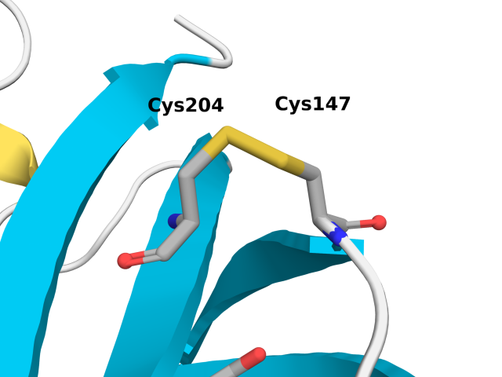
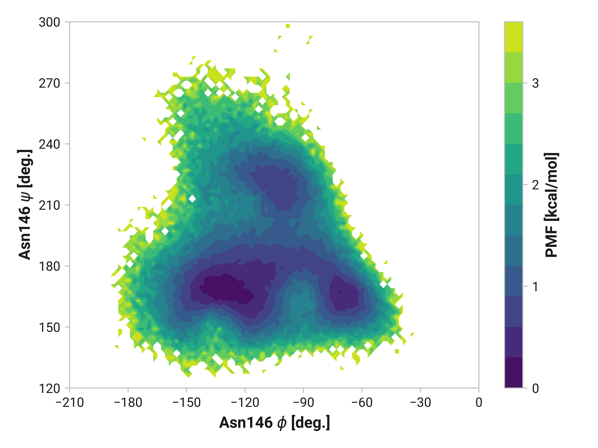
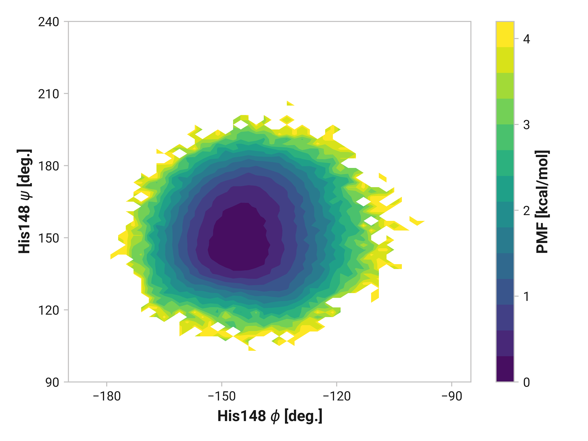
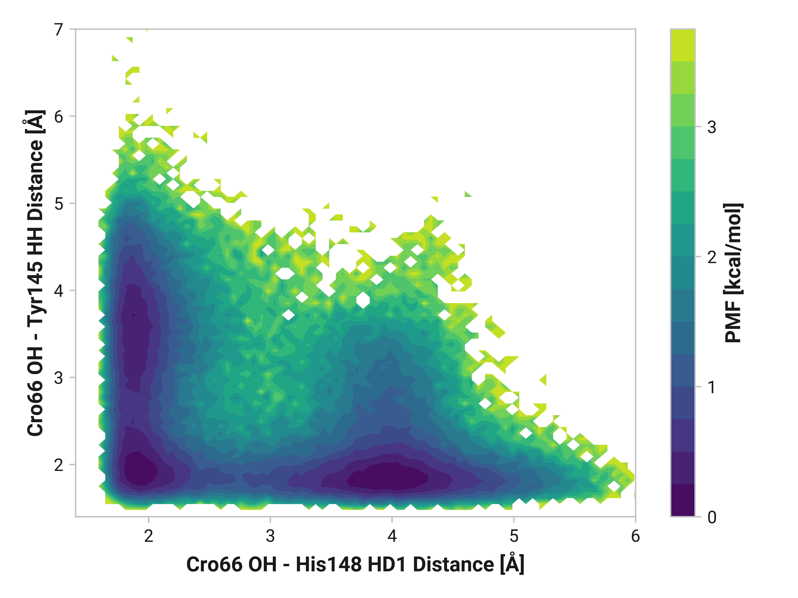
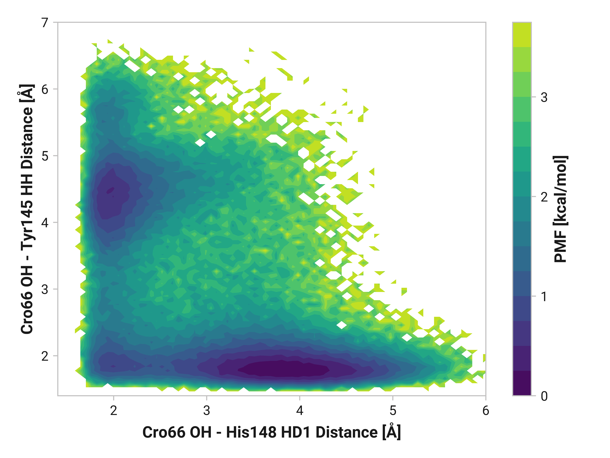
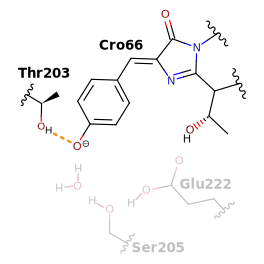
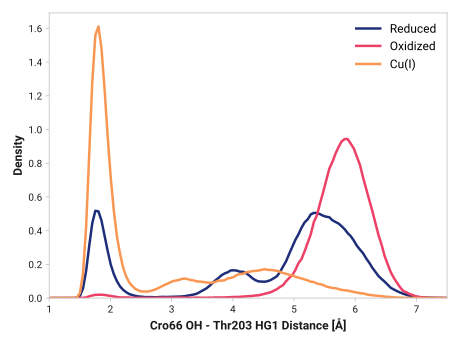

# R002 - Molecular simulations

This report details our observations from classical molecular dynamics (MD) simulations of roGFP2 [^hanson2004investigating] with

-   the anionic chromophore in the ground state;
-   neutral and anionic Glu222.

roGFP2 is derived from enhanced GFP (eGFP; S65T and F64L mutations) with S147C and Q204C mutations.
These simulations allow us to probe the affect of roGFP2 oxidation and Cu(I) binding of Cys147 and 204.
We performed the following three sets of simulations.

=== "Reduced"

    Cys147 and Cys204 remain in their reduced (i.e., protonated) form.

    <figure markdown>
    { width=600 }
    </figure>

=== "Oxidized"

    Disulfide bridge between Cys147 and Cys204.

    <figure markdown>
    { width=600 }
    </figure>

=== "Cu(I)"

    Reduced Cys147 and Cys204 with a coordinated Cu(I).

    <figure markdown>
    { width=600 }
    </figure>

Differences between reduced and oxidized states are indicative of the canonical roGFP2 atomistic mechanism.
If we observe similar differences between reduced and copper states, this would suggest a similar mechanism as the oxidized state; however, deviations between oxidized and copper would suggest a separate mechanism.

???+ note

    We experimentally observe the following changes in relative fluorescence:

    - 1 mM H2O2
        - Modest A band increase
        - Slight B band decrease
    - 1 μM Cu(I)
        - Slight A band decrease
        - Large B band decrease.

## Backbone changes

We first investigate the structural dynamics of Cys147 and Cys204 interactions by analyzing the C$_\alpha$-C$_\alpha$ distances.

!!! quote ""
    <figure markdown>
    { width=600 }
    </figure>

    For more figure information, go [here](../../../figures/b-cys/b004-cys147_ca-cys204_ca/).

As expected, the formation of the disulfide bridge in the oxidized state induces a highly strained conformation, with a C$_\alpha$-C$_\alpha$ distance of approximately 4.07 Å, closely matching the experimental average distance of 4.04 ± 0.09 Å [^hanson2004investigating].
In contrast, a reduced—albeit partially oxidized—crystal structure of roGFP2 exhibits a distance of 4.30 ± 0.12 Å [^hanson2004investigating], which aligns with our simulation peak at 4.31 Å.

The binding of Cu(I) to roGFP2 induces significant structural changes, particularly in the protein's conformation.
The observed increase in the C$_\alpha$-C$_\alpha$ distance from approximately 4.3 Å to a broader distribution centered around 4.48 Å and 4.96 Å indicates a marked increase in conformational flexibility.
These residues are adjacent to residues crucial to the GFP fluorescence mechanism involving Thr203 and Ser205.

!!! quote ""
    <figure markdown>
    { width=600 }
    </figure>

    For more figure information, go [here](../../../figures/b-cys/b005-cys147_sg-cys204_sg/).

### Cys147

=== "Reduced"

    <figure markdown>
    { width=700 }
    </figure>

=== "Oxidized"

    <figure markdown>
    { width=700 }
    </figure>

=== "Cu(I)"

    <figure markdown>
    { width=700 }
    </figure>

#### Tyr145

=== "Reduced"

    <figure markdown>
    { width=700 }
    </figure>

=== "Oxidized"

    <figure markdown>
    { width=700 }
    </figure>

=== "Cu(I)"

    <figure markdown>
    { width=700 }
    </figure>

#### Asn146

=== "Reduced"

    <figure markdown>
    { width=700 }
    </figure>

=== "Oxidized"

    <figure markdown>
    { width=700 }
    </figure>

=== "Cu(I)"

    <figure markdown>
    { width=700 }
    </figure>

#### His148

=== "Reduced"

    <figure markdown>
    { width=700 }
    </figure>

=== "Oxidized"

    <figure markdown>
    { width=700 }
    </figure>

=== "Cu(I)"

    <figure markdown>
    { width=700 }
    </figure>

### Cys204

=== "Reduced"

    <figure markdown>
    { width=700 }
    </figure>

=== "Oxidized"

    <figure markdown>
    { width=700 }
    </figure>

=== "Cu(I)"

    <figure markdown>
    { width=700 }
    </figure>

#### Thr203

=== "Reduced"

    <figure markdown>
    { width=700 }
    </figure>

=== "Oxidized"

    <figure markdown>
    { width=700 }
    </figure>

=== "Cu(I)"

    <figure markdown>
    { width=700 }
    </figure>

#### Ser205

=== "Reduced"

    <figure markdown>
    { width=700 }
    </figure>

=== "Oxidized"

    <figure markdown>
    { width=700 }
    </figure>

=== "Cu(I)"

    <figure markdown>
    { width=700 }
    </figure>

## Cro66 interactions

### Tyr145 and His148

`HD1` in His148 is typically around 1.85 Å away from the anionic phenolate oxygen in the chromophore; however, the 3.97-Å state is only 0.6 kcal/mol higher in energy.

Furthermore, We see parallel results to His148 in Tyr145 dynamics.
Both reduced and oxidized simulations primarily have sharp peaks around 1.80 Å between the Tyr145 phenolic hydrogen and Cro66.
This hydrogen bonding would further stabilize the anionic chromophore.
However, a bimodal peak is observed upon Cu(I) binding due to changing dynamics in Cys147 and Cys204.
A second peak at 4.42 Å is only 1 kcal/mol higher in energy than the 1.75 Å minimum with a 2.0 kcal/mol barrier.

=== "Reduced"

    <figure markdown>
    { width=700 }
    </figure>

=== "Oxidized"

    <figure markdown>
    { width=700 }
    </figure>

=== "Cu(I)"

    <figure markdown>
    { width=700 }
    </figure>

Both oxidized and Cu(I) simulations exhibit substantial deviations from the reduced state in different ways.
His148&mdash;protonated at the $\delta$ position&mdash;more frequently is hydrogen bonded to Cro66 with oxidized Cys147 and Cys204.
In the reduced simulations, the 1.85-Å state is only 0.6 kcal/mol lower in energy than the 3.97-Å state with a 0.9 kcal/mol kinetic barrier.
This Cro66-stabilizing transition is completely downhill for the oxidized simulations by -1.5 kcal/mol.

Cu(I) binding exhibits a bimodal distribution with similar peaks as the reduced state; however, the two states differ by only 0.3 kcal/mol and about half the kinetic barrier.
Additional His148 conformational diversity could very well destabilize the anionic chromophore, potentially leading to reduced quantum yield.

### Thr203 and H2O

=== "Reduced"

    <figure markdown>
    { width=700 }
    </figure>

=== "Oxidized"

    <figure markdown>
    { width=700 }
    </figure>

=== "Cu(I)"

    <figure markdown>
    { width=700 }
    </figure>

## More frequent non-adiabatic crossings could diminish florescence

!!! quote ""
    <figure markdown>
    { width=600 }
    </figure>

!!! quote ""
    <figure markdown>
    { width=600 }
    </figure>

## Cu(I) binding perturbs Thr203 dynamics

TODO:

!!! quote ""
    <figure markdown>
    { width=600 }
    </figure>

!!! quote ""
    <figure markdown>
    { width=600 }
    </figure>

## Broken chromophore reprotonation between Glu222 and Ser205

The last step of the [canonical photocycle](../fluorescence-mechanism/#photocycle) is reprotonation of of anionic chromophore through a GLU222, SER205, WAT, and finally CRO66 proton wire.
Intermolecular distances distances between each chemical species is a common feature to describe potential proton transfers in MD simulations.

!!! quote ""
    <figure markdown>
    { width=600 }
    </figure>

!!! quote ""
    <figure markdown>
    { width=600 }
    </figure>

<!-- References -->

[^hanson2004investigating]: Hanson, G. T., Aggeler, R., Oglesbee, D., Cannon, M., Capaldi, R. A., Tsien, R. Y., & Remington, S. J. (2004). Investigating mitochondrial redox potential with redox-sensitive green fluorescent protein indicators. Journal of Biological Chemistry, 279(13), 13044-13053. DOI: [10.1074/jbc.M312846200](https://doi.org/10.1074/jbc.M312846200)
