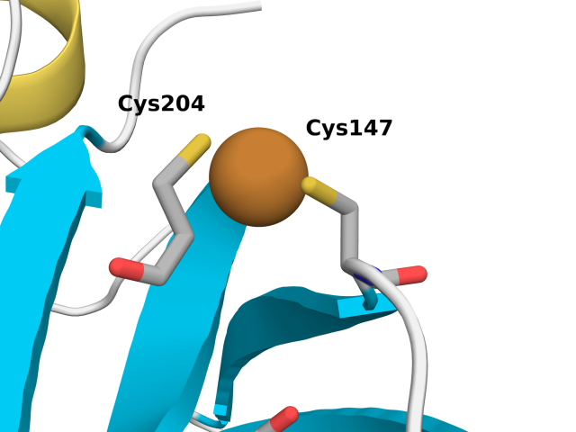
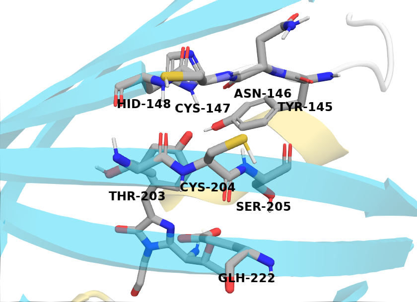
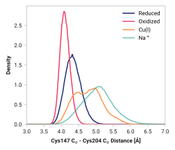
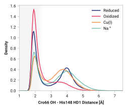
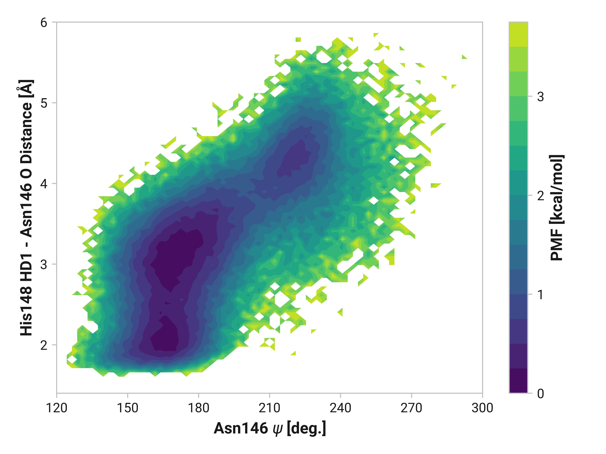

# R002 - Molecular simulations

This report details our observations from classical molecular dynamics (MD) simulations of roGFP2 [^hanson2004investigating] with

-   the anionic chromophore in the ground state;
-   neutral and anionic Glu222.

roGFP2 is derived from enhanced GFP (eGFP; S65T and F64L mutations) with S147C and Q204C mutations.
These simulations allow us to probe the affect of roGFP2 oxidation and Cu(I) binding of Cys147 and 204.
We performed the following three sets of simulations.

=== "Reduced"

    Cys147 and Cys204 remain in their reduced (i.e., protonated) form.

    <figure markdown>
    { width=700 }
    </figure>

=== "Oxidized"

    Disulfide bridge between Cys147 and Cys204.

    <figure markdown>
    { width=700 }
    </figure>

=== "Cu(I)"

    Reduced Cys147 and Cys204 with a coordinated Cu(I).

    <figure markdown>
    { width=700 }
    </figure>

Differences between reduced and oxidized states are indicative of the canonical roGFP2 atomistic mechanism.
If we observe similar differences between reduced and copper states, this would suggest a similar mechanism as the oxidized state; however, deviations between oxidized and copper would suggest a separate mechanism.

The figure below shows relevant residues involved in our analysis.

<figure markdown>
{ width=700 }
</figure>

## Backbone

First, we investigate the structural dynamics of Cys147 and Cys204 interactions by analyzing the C$_\alpha$-C$_\alpha$ distances.
Experimental structures of both the reduced (PDB ID: [1JC0](https://www.rcsb.org/structure/1JC0)) and oxidized (PDB ID: [1JC1](https://www.rcsb.org/structure/1JC1)) states of for roGFP2 exhibited a mean C$_\alpha$-C$_\alpha$ distance of 4.30 ± 0.12 and 4.07 ± 0.09, respectively. [^hanson2004investigating]
Our MD simulations agreed well with experimental observations as shown in the following table.

!!! quote "Table 1: C$_\alpha$-C$_\alpha$ distance mean ± 2std."
    | State | Experimental (Å) | MD simulations (Å) |
    | ----- | ------------ | -------------- |
    | **Reduced** | 4.30 ± 0.12 | 4.34 ± 0.47 |
    | **Oxidized** | 4.07 ± 0.09 | 4.11 ± 0.29 |
    | **Cu(I)** | N/A | 4.78 ± 0.82 |

Larger standard deviations, $\sigma$, would be expected for molecular simulations due to capturing the dynamic fluctuations in solution.
Figure 1 shows the observed distribution of C$_\alpha$-C$_\alpha$ distances.

!!! quote "Figure 1: C$_\alpha$-C$_\alpha$ distance probability density."
    <figure markdown>
    { width=700 }
    </figure>

    For more figure information, go [here](../../../figures/b-cys/b004-cys147_ca-cys204_ca/).

Cu(I) binding to Cys147 and Cys204 in roGFP2 induces significant structural changes, particularly in the protein's conformation.
The observed increase in the C$_\alpha$-C$_\alpha$ distance from approximately 4.3 Å to a broader distribution centered around 4.48 Å and 4.96 Å indicates a marked increase in conformational flexibility.
Cu(I) coordination to Cys147 and Cys204 thiolates (R-S&ndash;) also hinders rotational flexibility with respect to the thiols (R-S-H) in the reduced simulations.

!!! quote "Figure 2: Probability density of sulfur atom distance between Cys147 and Cys204."
    <figure markdown>
    { width=700 }
    </figure>

    For more figure information, go [here](../../../figures/b-cys/b005-cys147_sg-cys204_sg/).

These two cystines are near residues that play a crucial role in the GFP mechanism; thus, one would expect differences in the protein backbone $\phi$ and $\psi$ angles.
In the following sections, we show two-dimensional histograms of the potential of mean force (PMF) of these backbone angles (i.e., Ramachandran plot).
We will refer to these plots as backbone PMFs.

### Cys147

Differences in oxidized and Cu(I) in the $\phi$ dihedral angle (Asn146 C Cys147 N-C$_\alpha$-C dihedral) are observed with respect to the reduced simulations.
In particular, Cu(I) simulations have substantially reduced $\phi < 90$ angles that are frequently observed in both reduced and oxidized states.
$\psi$ ranges are also increased upon the binding of Cu(I).

=== "Reduced"

    <figure markdown>
    { width=700 }
    </figure>

=== "Oxidized"

    <figure markdown>
    { width=700 }
    </figure>

=== "Cu(I)"

    <figure markdown>
    { width=700 }
    </figure>

#### Asn146

Indeed, the large $\phi$Cys147 distribution shift we observe also impacts Asn146.
Reduced and oxidized simulations exhibit an additional local minima around $\phi$Asn146 = -115° and $\psi$Asn146 = 220° not present in Cu(I) simulations.

=== "Reduced"

    <figure markdown>
    { width=700 }
    </figure>

=== "Oxidized"

    <figure markdown>
    { width=700 }
    </figure>

=== "Cu(I)"

    <figure markdown>
    { width=700 }
    </figure>

#### Tyr145

We do see some differences in oxidized and Cu(I) simulations; however, these are subtle compared to Asn146.

=== "Reduced"

    <figure markdown>
    { width=700 }
    </figure>

=== "Oxidized"

    <figure markdown>
    { width=700 }
    </figure>

=== "Cu(I)"

    <figure markdown>
    { width=700 }
    </figure>

#### His148

If we go one more residue further down the backbone, we see that His148 backbone dihedrals are relative similar across simulations.
Cu(I) does have slightly larger ranges (i.e., backbone flexibility), but this does not appear nearly as drastic as Asn146.

=== "Reduced"

    <figure markdown>
    { width=700 }
    </figure>

=== "Oxidized"

    <figure markdown>
    { width=700 }
    </figure>

=== "Cu(I)"

    <figure markdown>
    { width=700 }
    </figure>

### Cys204

Changes in Cys204 would arguably have drastic consequences for roGFP2 florescence due to the adjacent residues (e.g., Thr203 and Ser205).
Here, we see enhanced flexibility in $\psi$Cys204 for oxidized simulations in the 70 to 120° region to favor cis conformations&mdash;even more so in Cu(I) simulations.
Cu(I) simulations also have reduced entropy around $\phi$Cys204 = -145° and $\psi$Cys204 = 150°.

=== "Reduced"

    <figure markdown>
    { width=700 }
    </figure>

=== "Oxidized"

    <figure markdown>
    { width=700 }
    </figure>

=== "Cu(I)"

    <figure markdown>
    { width=700 }
    </figure>

#### Thr203

Reduced and oxidized simulations show similar Thr203 backbone conformational dynamics.
Cu(I) simulations, on the other hand, has dramatically reduced flexibility with a minima around $\phi$Thr203 = 175° and $\psi$Thr203 = 155°.

=== "Reduced"
    <figure markdown>
    { width=700 }
    </figure>

=== "Oxidized"
    <figure markdown>
    { width=700 }
    </figure>

=== "Cu(I)"
    <figure markdown>
    { width=700 }
    </figure>

#### Ser205

Here, we see similarly enhanced flexibility in both oxidized and Cu(I) simulations.

=== "Reduced"

    <figure markdown>
    { width=700 }
    </figure>

=== "Oxidized"

    <figure markdown>
    { width=700 }
    </figure>

=== "Cu(I)"

    <figure markdown>
    { width=700 }
    </figure>

### Summary

Distinct structural changes in the protein backbone are observed upon oxidation or Cu(I) binding to [Cys147](#cys147) and [Cys204](#cys204) of roGFP2.
Besides clear differences in cysteine sensor dynamics, there is clear evidence of structural changes in nearby residues also relevant for chromophore florescence.

-   Reduced and oxidized simulations have similar [Asn146](#asn146) backbone dynamics&mdash;whereas Cu(I) binding exhibits substantial deviations.
-   [Thr203](#thr203) also has large changes in Cu(I), but not in oxidized, simulations.

Other residues do have subtle differences between the reduced, oxidized, and Cu(I) simulations.

## Beta sheets

In this section, we further analyze potential changes in roGFP2's secondary structure.
Most of these aforementioned residues are either in, or near, antiparallel beta sheet.
Changes in these backbones could therefore stabilize or destabilize the hydrogen-bonding network.
Below, we show two relevant -NH to O= hydrogen bonding near the cysteine sensor residues.

### His148 to Thr203

Forming a disulfide bond between Cys147 and Cys204 substantially stabilizes the beta-sheet.
Indeed, the hydrogen bonding probability increases from 0.865 to 0.997 when using a H to O cutoff of 2.5 Å. (For a cutoff rationale, please see our [protocol](../../../methods/01-protocols/hbond).)
Cu(I) binding induces the opposite effect by destabilizing the beta strand with a probability of 0.063 of forming the hydrogen bond.

!!! quote ""
    <figure markdown>
    { width=700 }
    </figure>

We can elucidate the mechanism by plotting 2D histograms of this His148 -NH to Thr203 =O distance with respect to relevant dihedral angles.
If correlated, we would see distinct patterns in the PMFs.

The figures below show this distance with respect to $\psi$Thr203 or $\phi$His148.
Larger distances (i.e., destabilized beta-sheet) are weakly positively correlated with $\psi$Thr203; with distances beyond 2.5 Å are primarily observed in trans-like conformations.
Values of $\phi$His148 do not appear to be more relevant for longer distances as the 2D PMF appears roughly symmetric across the y-axis.

=== "Reduced"
    <figure markdown>
    { width=700 }
    </figure>

    <figure markdown>
    { width=700 }
    </figure>

=== "Oxidized"
    <figure markdown>
    { width=700 }
    </figure>

    <figure markdown>
    { width=700 }
    </figure>

=== "Cu(I)"
    <figure markdown>
    { width=700 }
    </figure>

    <figure markdown>
    { width=700 }
    </figure>

### Asn146 to Ser205

On other other side of Cys147 and Cys204, there is little hydrogen bonding present in the reduced simulations with only a 0.047 probability.
Hydrogen bond probability increases to 0.144 during the oxidized simulations, but no hydrogen bonding is observed.

!!! quote ""
    <figure markdown>
    { width=700 }
    </figure>

### Summary

TODO:

## Cro66 interactions

Oxidized and Cu(I) simulations show markedly different backbone dynamics.

TODO: write introduction.

### His148

His148 HD1 is typically around 1.85 Å away from the anionic phenolate oxygen in the chromophore; however, the 3.97-Å state is only 0.6 kcal/mol higher in energy.
TODO: write more.

!!! quote ""
    <figure markdown>
    { width=700 }
    </figure>

TODO: If not hydrogen binding to CRO, where to?

=== "Reduced"

    <figure markdown>
    { width=700 }
    </figure>

=== "Oxidized"

    <figure markdown>
    { width=700 }
    </figure>

=== "Cu(I)"

    <figure markdown>
    { width=700 }
    </figure>

TODO:

=== "Reduced"

    <figure markdown>
    { width=700 }
    </figure>

=== "Oxidized"

    <figure markdown>
    { width=700 }
    </figure>

=== "Cu(I)"

    <figure markdown>
    { width=700 }
    </figure>

### Tyr145

!!! quote ""
    <figure markdown>
    { width=700 }
    </figure>

Furthermore, we see parallel results to His148 in Tyr145 dynamics.
Both reduced and oxidized simulations primarily have sharp peaks around 1.80 Å between the Tyr145 phenolic hydrogen and Cro66.
This hydrogen bonding would further stabilize the anionic chromophore.
However, a bimodal peak is observed upon Cu(I) binding due to changing dynamics in Cys147 and Cys204.
A second peak at 4.42 Å is only 1 kcal/mol higher in energy than the 1.75 Å minimum with a 2.0 kcal/mol barrier.

TODO: Thr64 OG1 is protonated; no hydrogen bonding (just a point of reference).

=== "Reduced"

    <figure markdown>
    { width=700 }
    </figure>

=== "Oxidized"

    <figure markdown>
    { width=700 }
    </figure>

=== "Cu(I)"

    <figure markdown>
    { width=700 }
    </figure>

### His148 and Tyr145

=== "Reduced"

    <figure markdown>
    { width=700 }
    </figure>

=== "Oxidized"

    <figure markdown>
    { width=700 }
    </figure>

=== "Cu(I)"

    <figure markdown>
    { width=700 }
    </figure>

Both oxidized and Cu(I) simulations exhibit substantial deviations from the reduced state in different ways.
His148&mdash;protonated at the $\delta$ position&mdash;more frequently is hydrogen bonded to Cro66 with oxidized Cys147 and Cys204.
In the reduced simulations, the 1.85-Å state is only 0.6 kcal/mol lower in energy than the 3.97-Å state with a 0.9 kcal/mol kinetic barrier.
This Cro66-stabilizing transition is completely downhill for the oxidized simulations by -1.5 kcal/mol.

Cu(I) binding exhibits a bimodal distribution with similar peaks as the reduced state; however, the two states differ by only 0.3 kcal/mol and about half the kinetic barrier.
Additional His148 conformational diversity could very well destabilize the anionic chromophore, potentially leading to reduced quantum yield.

### Thr203 and H2O

=== "Reduced"

    <figure markdown>
    { width=700 }
    </figure>

=== "Oxidized"

    <figure markdown>
    { width=700 }
    </figure>

=== "Cu(I)"

    <figure markdown>
    { width=700 }
    </figure>

<!-- References -->

[^hanson2004investigating]: Hanson, G. T., Aggeler, R., Oglesbee, D., Cannon, M., Capaldi, R. A., Tsien, R. Y., & Remington, S. J. (2004). Investigating mitochondrial redox potential with redox-sensitive green fluorescent protein indicators. Journal of Biological Chemistry, 279(13), 13044-13053. DOI: [10.1074/jbc.M312846200](https://doi.org/10.1074/jbc.M312846200)
