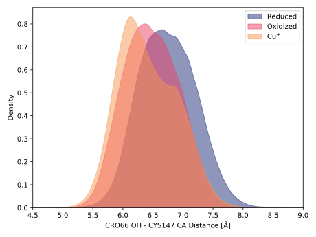
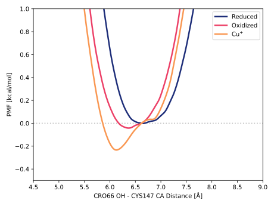

# 001-cro66_oh-cys147_ca

Our first check was to see if there was any structural change in the beta-sheet around the phenolic oxygen atom in the chromophore.
Distances between CRO66 OH and CYS147 CA are a simple proxy for bending the beta sheet.

## Visualization

<div id="rogfp-view" class="mol-container"></div>
<script>
var uri = 'https://files.rcsb.org/view/1jc0.pdb';
jQuery.ajax( uri, {
    success: function(data) {
        // https://3dmol.org/doc/GLViewer.html
        let viewer = $3Dmol.createViewer(
            document.querySelector('#rogfp-view'),
            { backgroundAlpha: '0.0' }
        );
        let resi1 = 66;
        let atom1Name = "OH";
        let resi2 = 147;
        let atom2Name = "CA";
        viewer.addModel( data, 'pdb' );
        viewer.setStyle({chain: 'A'}, {cartoon: {color: 'spectrum', opacity: 0.65}});
        viewer.setStyle({chain: 'A', resi: 66}, {stick: {}, cartoon: {color: "spectrum", opacity: 0.65}});
        viewer.setStyle({chain: 'A', resi: 145}, {stick: {}, cartoon: {color: "spectrum", opacity: 0.65}});
        viewer.setStyle({chain: 'A', resi: 147}, {stick: {}, cartoon: {color: "spectrum", opacity: 0.65}});
        viewer.setStyle({chain: 'A', resi: 148}, {stick: {}, cartoon: {color: "spectrum", opacity: 0.65}});
        viewer.setStyle({chain: 'A', resi: 203}, {stick: {}, cartoon: {color: "spectrum", opacity: 0.65}});
        viewer.setStyle({chain: 'A', resi: 204}, {stick: {}, cartoon: {color: "spectrum", opacity: 0.65}});
        viewer.setStyle({chain: 'A', resi: 205}, {stick: {}, cartoon: {color: "spectrum", opacity: 0.65}});
        viewer.setStyle({chain: 'A', resi: 222}, {stick: {}, cartoon: {color: "spectrum", opacity: 0.65}});
        viewer.setStyle({chain: 'B'}, {});
        viewer.setStyle({chain: 'C'}, {});
        viewer.setView([ -184.47333957331193, -10.067926666942217, -44.53875969510262, 103.91875825735853, 0.9311870129599452, 0.33020463035200476, 0.03182696674634526, 0.15113799382206267 ]);
        let atom1 = viewer.getModel().selectedAtoms(
            {chain: 'A', resi: resi1, atom: atom1Name}
        )[0];
        let atom2 = viewer.getModel().selectedAtoms(
            {chain: 'A', resi: resi2, atom: atom2Name}
        )[0];
        viewer.addCylinder(
            {
                dashed: true,
                start: {x: atom1.x, y: atom1.y, z: atom1.z},
                end: {x: atom2.x, y: atom2.y, z: atom2.z},
                radius: 0.1,
                color: "#00b4d8"
            }
        );
        viewer.setClickable({}, true, function(atom,viewer,event,container) {
            console.log(viewer.getView());
        });
        viewer.render();
    },
    error: function(hdr, status, err) {
        console.error( "Failed to load " + uri + ": " + err );
    },
});
</script>

## Probability density function

We can gain some statistical insights by plotting the kernel-density estimate approximation of the probability density function (PDF).

<figure markdown>

</figure>

In the **unbound** state, we see a broad peak with a maximum at 6.65 Å.
This large variability suggests that the CYS residues can access a variety of conformational states (i.e., flexible).

In contrast, the **bound** state exhibits a sharper peak at 6.13 Å ($\Delta =$ &ndash;0.52 Å), implying that the binding of Cu(I) leads to a more specific, consistent interaction.
There is also substantial overlap between the two distributions.

### Bandwidth validation

The figure below shows the histogram and the PDF to validate the bandwidth parameter.
A value of `0.1` was used for both figures.

<figure markdown>

</figure>

## Potential of mean force

<figure markdown>

</figure>

## Relevant scripts

```python title="roGFP2 distances"
--8<-- "study/analysis/001-rogfp-md/scripts/cro65_oh-cym145_ca-dist.py"
```

```python title="roGFP2 and Cu(I) distances"
--8<-- "study/analysis/003-rogfp-cu-md/scripts/cro65_oh-cym145_ca-dist.py"
```

```python title="PDF figure"
--8<-- "study/figures/001-cro66_oh-cys147_ca/pdf.py"
```
