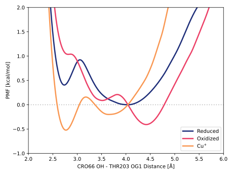
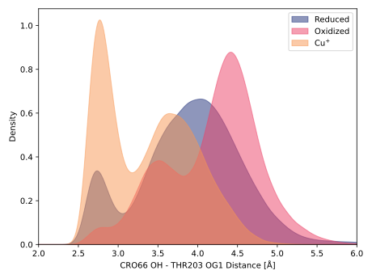

# 003-cro66_oh-thr203_og1

Looking at threonine (THR) 203 will investigate if the chemical environment around the chromophore changes.

## Visualization

## Potential of mean force

TODO:

<figure markdown>

</figure>

## Probability density function

The figure below shows the distance PDF of CRO66 OH to THR203 OG1.

<figure markdown>

</figure>

rogfp2
y-axis local maxima: [6.64229914e-01 3.36391256e-01 4.07651219e-05]
x-values: [4.03603604 2.73873874 7.85585586]

rogfp2-cu
y-axis local maxima: [1.02555169e+00 5.97934439e-01 9.44273947e-05]
x-values: [2.76576577 3.64864865 5.63963964]

### Bandwidth validation

The figure below shows the histogram and the PDF to validate the bandwidth parameter.
A value of `0.1` was used for both figures.

<figure markdown>

</figure>
