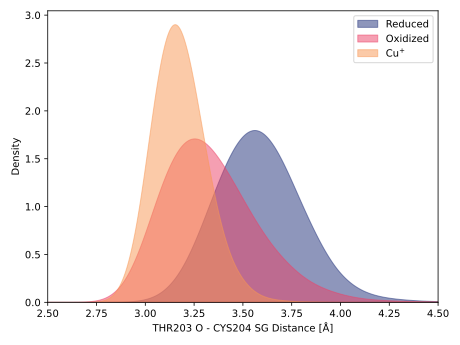
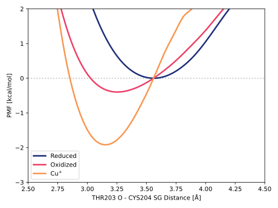

# 008-thr203_o-cys204_sg

TODO:

## Probability density function

<figure markdown>

</figure>

### Quantitative

--8<-- "study/figures/008-thr203_o-cys204_sg/pdf-info.md"

### Bandwidth validation

<figure markdown>

</figure>

## Potential of mean force

<figure markdown>

</figure>

### Quantitative

--8<-- "study/figures/008-thr203_o-cys204_sg/pmf-info.md"
