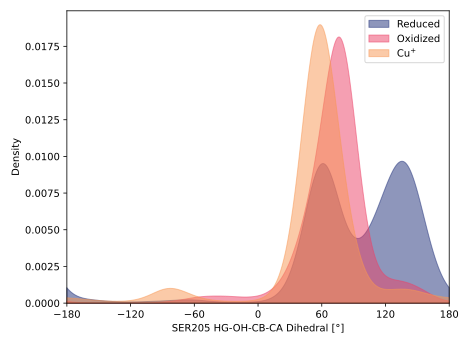
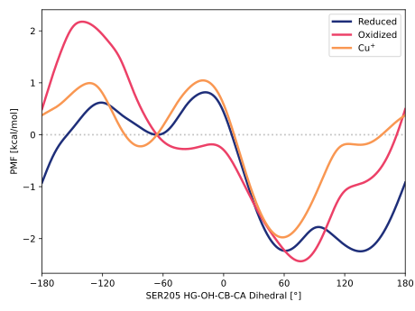

# 011-ser205_hg_og_cb_ca

TODO:

## Probability density function

<figure markdown>

</figure>

### Quantitative

--8<-- "study/figures/011-ser205_hg_og_cb_ca/pdf-info.md"

## Potential of mean force

TODO:

<figure markdown>

</figure>

### Quantitative

--8<-- "study/figures/011-ser205_hg_og_cb_ca/pmf-info.md"
