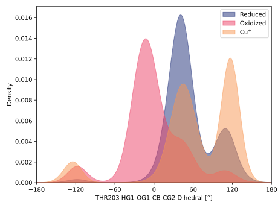
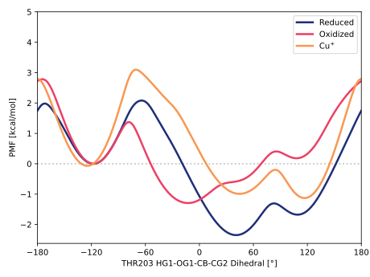

# 012-thr203_hg1_og1_cb_cg2

TODO:

## Probability density function

<figure markdown>

</figure>

### Quantitative

--8<-- "study/figures/012-thr203_hg1_og1_cb_cg2/pdf-info.md"

## Potential of mean force

TODO:

<figure markdown>

</figure>

### Quantitative

--8<-- "study/figures/012-thr203_hg1_og1_cb_cg2/pmf-info.md"
