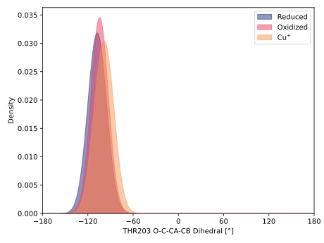
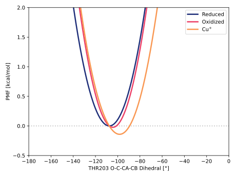

# 013-thr203_o_c_ca_cb

TODO:

## Probability density function

<figure markdown>

</figure>

### Quantitative

--8<-- "study/figures/013-thr203_o_c_ca_cb/pdf-info.md"

## Potential of mean force

TODO:

<figure markdown>

</figure>

### Quantitative

--8<-- "study/figures/013-thr203_o_c_ca_cb/pmf-info.md"
