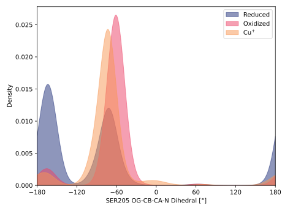
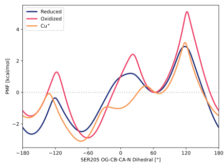

# 014-ser205_og_cb_ca_n

TODO:

## Probability density function

<figure markdown>

</figure>

### Quantitative

--8<-- "study/figures/014-ser205_og_cb_ca_n/pdf-info.md"

## Potential of mean force

TODO:

<figure markdown>

</figure>

### Quantitative

--8<-- "study/figures/014-ser205_og_cb_ca_n/pmf-info.md"
