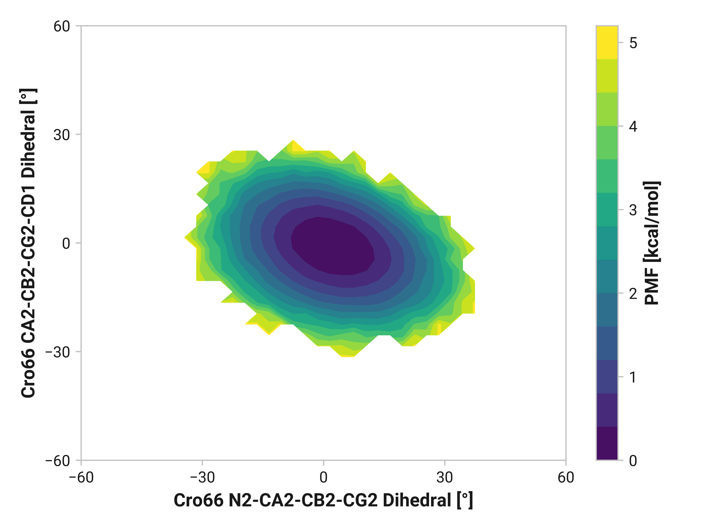
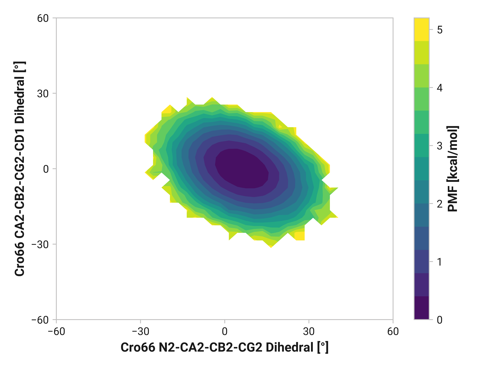
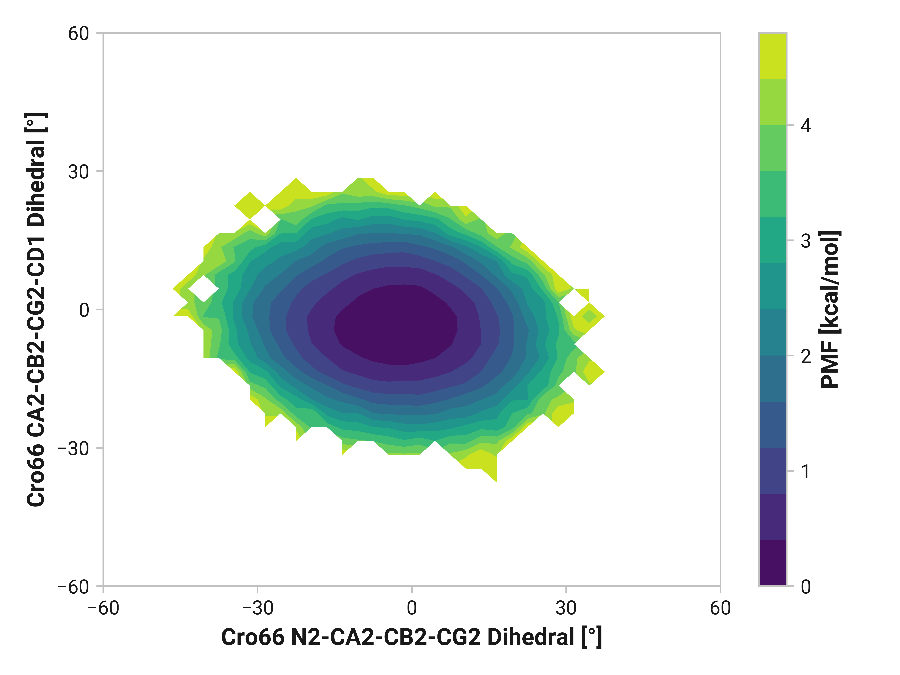

# A001: Cro66 dihedrals

## Probability densities

=== "Reduced"
    <figure markdown>
    
    </figure>

=== "Oxidized"
    <figure markdown>
    
    </figure>

=== "Cu(I)"
    <figure markdown>
    
    </figure>
