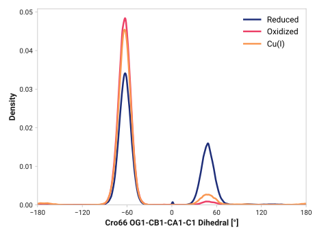
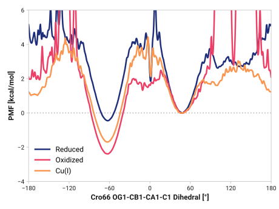

# A002: Cro66 OG1-CB1-CA1-C1

TODO:

## Probability density function

<figure markdown>

</figure>

### Quantitative

--8<-- "study/figures/a-cro/a002-cro66_og1_cb1_ca1_c1/pdf-info.md"

## Potential of mean force

TODO:

<figure markdown>

</figure>

### Quantitative

--8<-- "study/figures/a-cro/a002-cro66_og1_cb1_ca1_c1/pmf-info.md"
