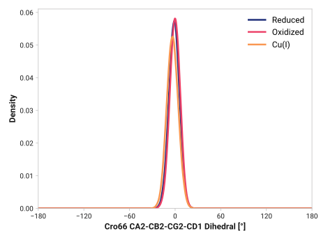
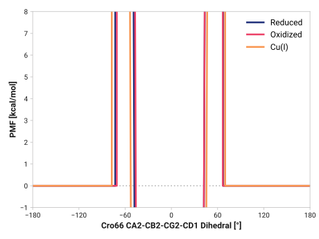

# a003-cro66_ca2_cb2_cg2_cd1

TODO:

## Probability density function

<figure markdown>

</figure>

### Quantitative

--8<-- "study/figures/a-cro/a003-cro66_ca2_cb2_cg2_cd1/pdf-info.md"

## Potential of mean force

TODO:

<figure markdown>

</figure>

### Quantitative

--8<-- "study/figures/a-cro/a003-cro66_ca2_cb2_cg2_cd1/pmf-info.md"
