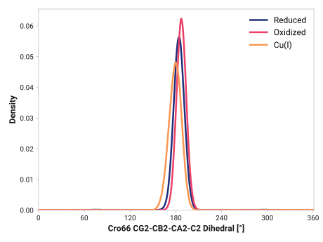

# a003-cro66_cg2_cb2_ca2_c2

TODO:

## Probability density function

<figure markdown>

</figure>

### Quantitative

--8<-- "study/figures/a-cro/a003-cro66_cg2_cb2_ca2_c2/pdf-info.md"

## Potential of mean force

TODO:

<figure markdown>

</figure>

### Quantitative

--8<-- "study/figures/a-cro/a003-cro66_cg2_cb2_ca2_c2/pmf-info.md"
