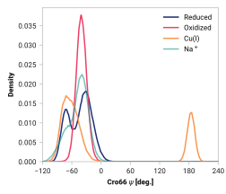

# A004: Cro66 ψ

## Probability density function

<figure markdown>
{ width=600 }
</figure>

| System | H bond |
| ------ | ------ |
| Reduced | 0.000 |
| Oxidized | 0.000 |
| Cu(I) | 0.249 |
| Na+ | 0.000 |

### Quantitative

--8<-- "study/figures/a-cro/a004-cro66_n3_ca3_c3_val68_n/pdf-info.md"
