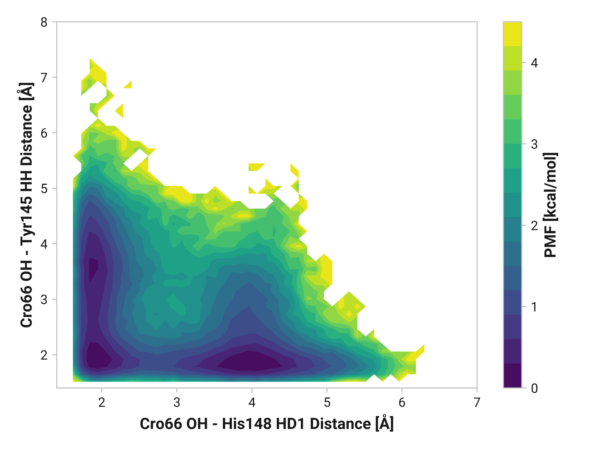
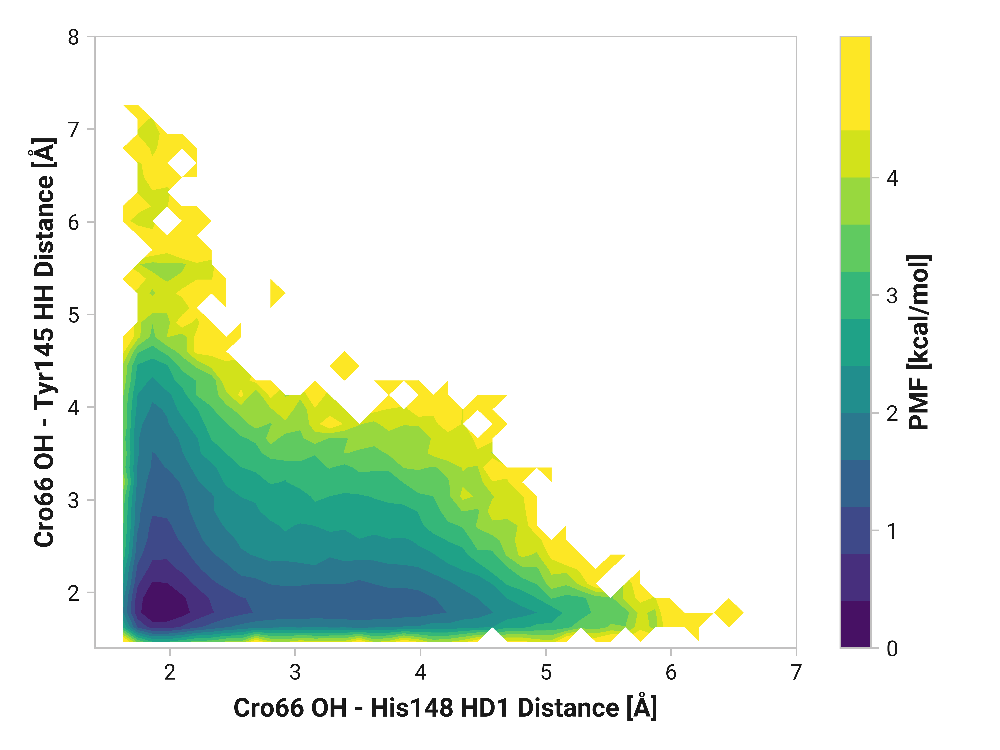
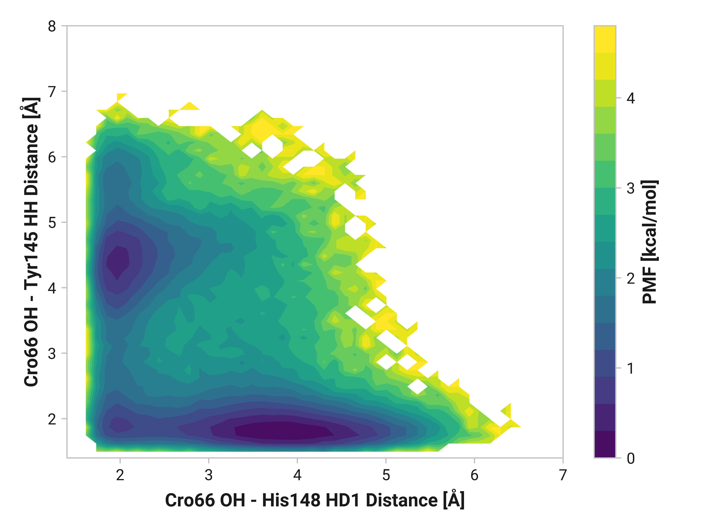
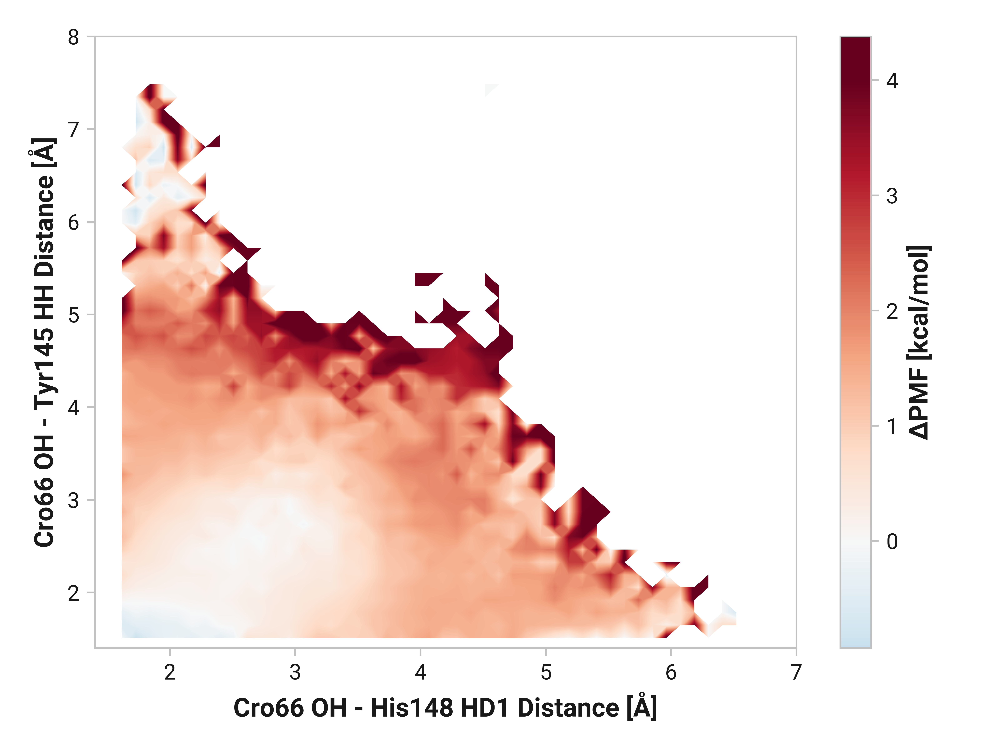
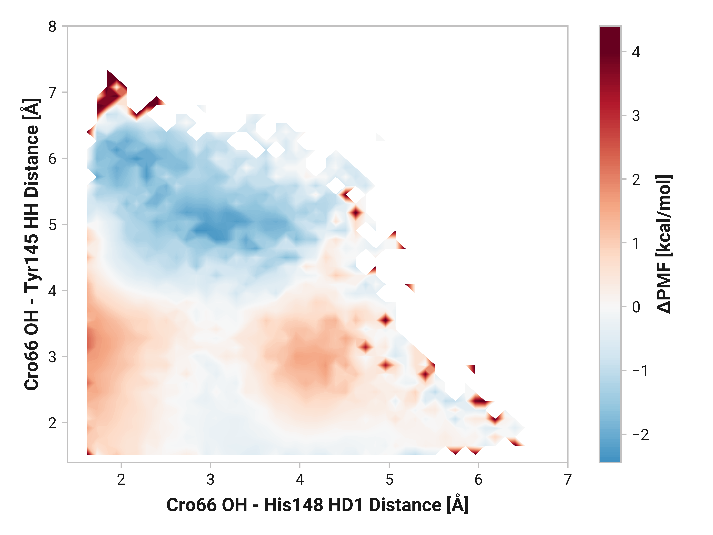

# b001 His148-HD1 and Tyr145-HH

TODO:

<figure markdown>

</figure>

<figure markdown>

</figure>

<figure markdown>

</figure>

## Differences

!!! quote "Oxidized vs. reduced"
    <figure markdown>
    
    </figure>

!!! quote "Cu(I) vs. reduced"
    <figure markdown>
    
    </figure>
