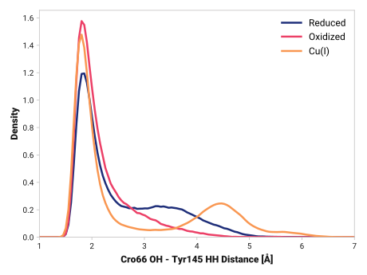
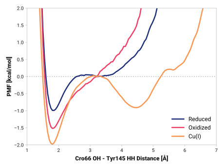

# b003-cro66_oh-tyr145_hh

TODO:

## Visualization

## Probability density function

<figure markdown>

</figure>

### Quantitative

--8<-- "study/figures/b-cro-between/b-cro-between/b003-cro66_oh-tyr145_hh/pdf-info.md"

### Bandwidth validation

<figure markdown>

</figure>

## Potential of mean force

<figure markdown>

</figure>

### Quantitative

--8<-- "study/figures/b-cro-between/b-cro-between/b003-cro66_oh-tyr145_hh/pmf-info.md"
