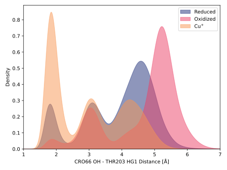
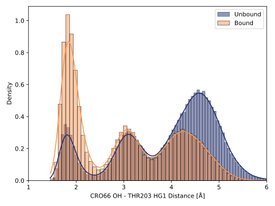
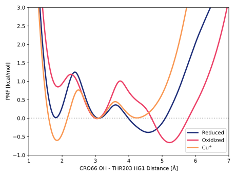

# b004-cro66_oh-thr203_hg1

TODO:

## Probability density function

<figure markdown>

</figure>

### Quantitative

--8<-- "study/figures/b-cro-between/b-cro-between/b004-cro66_oh-thr203_hg1/pdf-info.md"

### Bandwidth validation

<figure markdown>

</figure>

## Potential of mean force

TODO:

<figure markdown>

</figure>

### Quantitative

--8<-- "study/figures/b-cro-between/b-cro-between/b004-cro66_oh-thr203_hg1/pmf-info.md"
