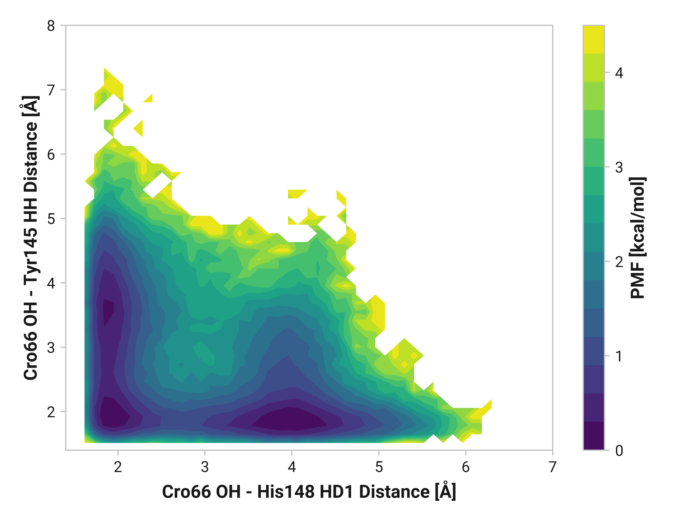
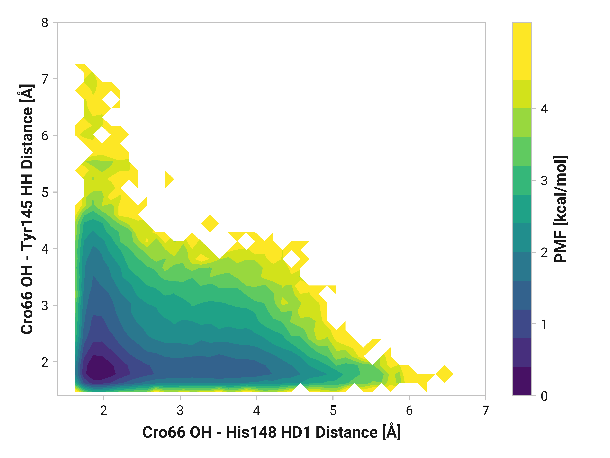
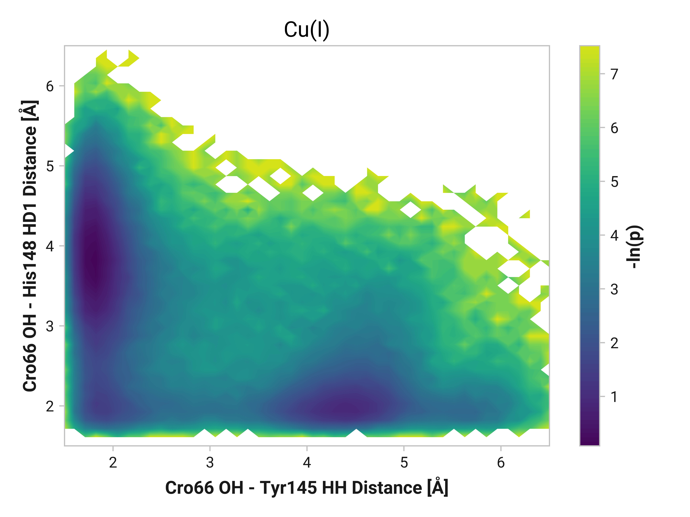
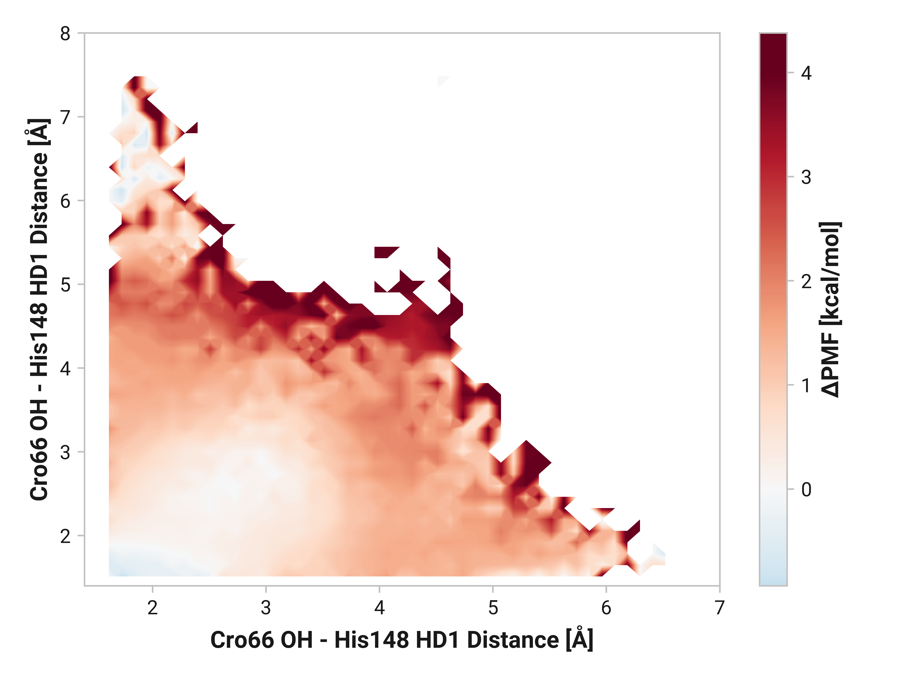

# b004-his148_hd1-tyr145_hh

TODO:

## Probability densities

<figure markdown>

</figure>

<figure markdown>

</figure>

<figure markdown>

</figure>

## Differences

!!! quote "Oxidized vs. reduced"
    <figure markdown>
    
    </figure>

!!! quote "Cu(I) vs. reduced"
    <figure markdown>
    
    </figure>
