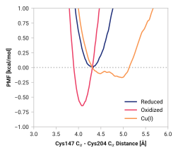

# B004: Cys147 CA - Cys204 CA

## Probability density function

<figure markdown>

</figure>

### Quantitative

--8<-- "study/figures/b-cys/b004-cys147_ca-cys204_ca/pdf-info.md"

## Potential of mean force

<figure markdown>

</figure>

### Quantitative

--8<-- "study/figures/b-cys/b004-cys147_ca-cys204_ca/pmf-info.md"

## Visualization

