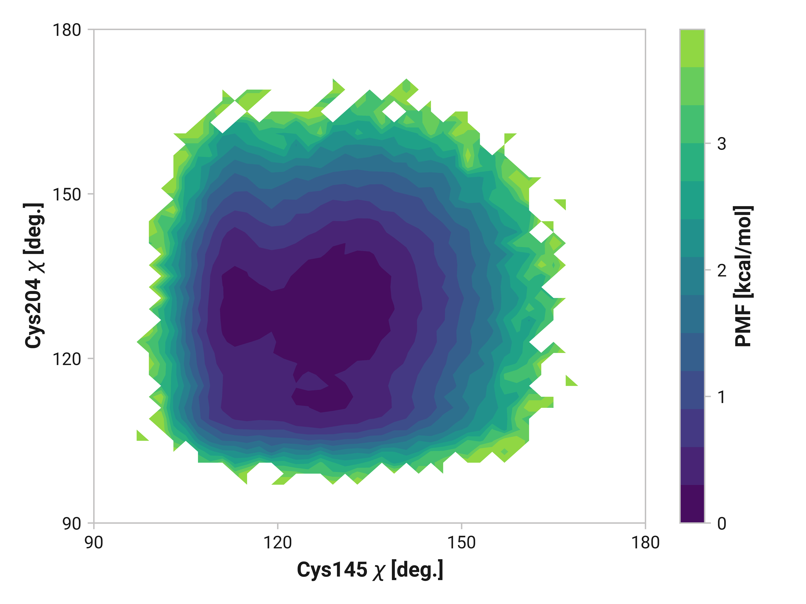
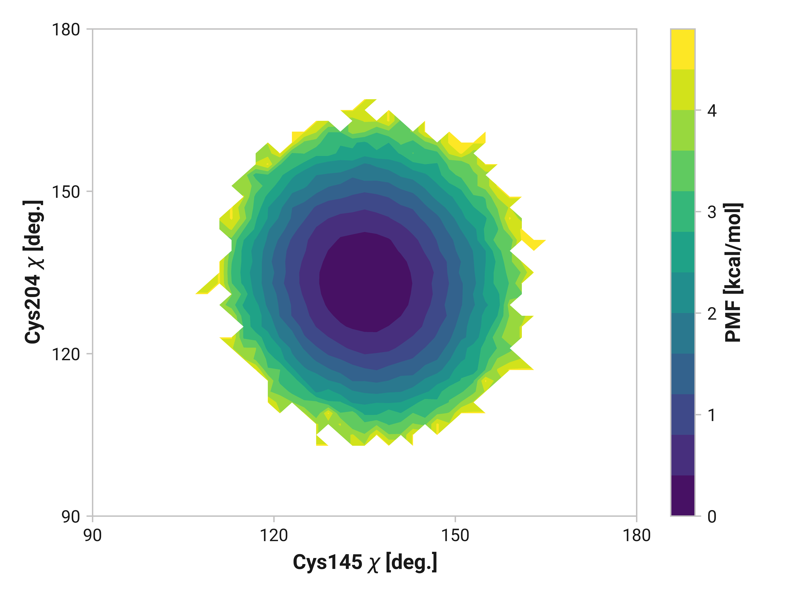
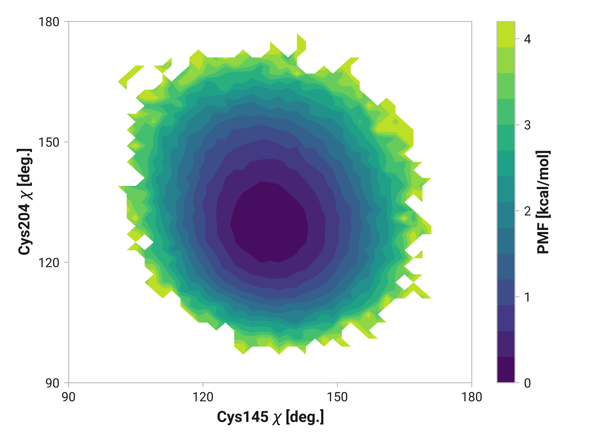

# f016-cys-chi

## Potential of mean force

### Reduced

!!! quote ""
    <figure markdown>
    
    </figure>

### Oxidized

!!! quote ""
    <figure markdown>
    
    </figure>

### Cu(I)

!!! quote ""
    <figure markdown>
    
    </figure>
