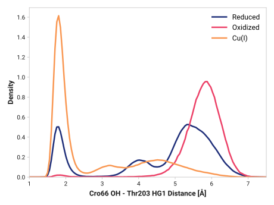

# D002: Cro66 OH to Thr203 HG1

TODO:

## Visualization

## Probability density function

<figure markdown>

</figure>

### Quantitative

--8<-- "study/figures/b-cro-between/d002-cro66_oh-thr203_hg1/pdf-info.md"

<figure markdown>

</figure>

## Potential of mean force

<figure markdown>

</figure>

### Quantitative

--8<-- "study/figures/b-cro-between/d002-cro66_oh-thr203_hg1/pmf-info.md"
