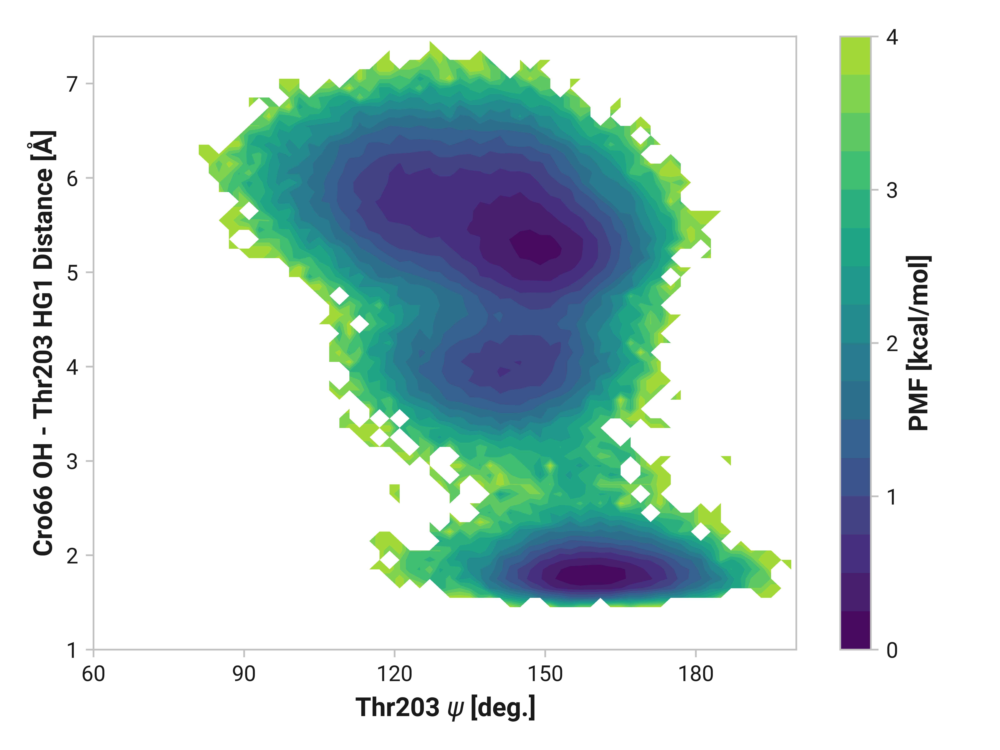
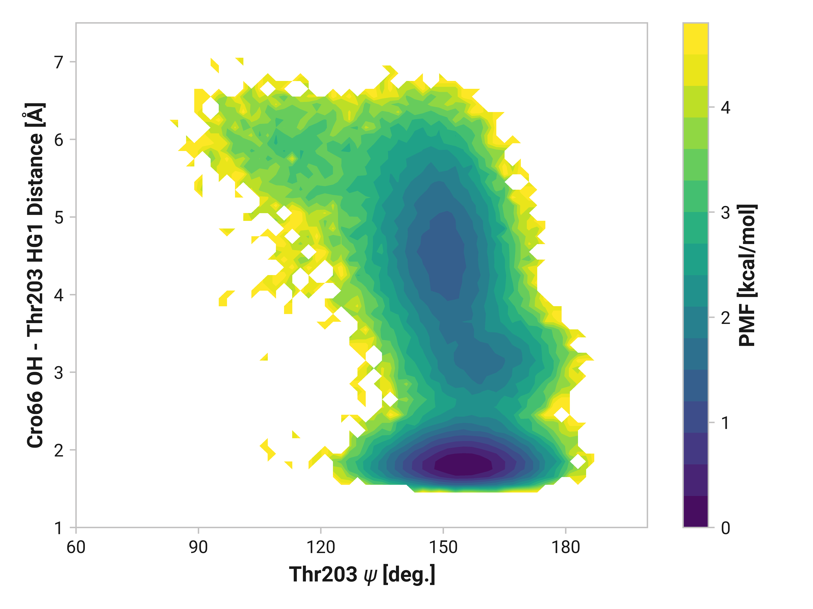

# D003: Thr203 ψ and Cro66 hydrogen bonding

## Probability densities

!!! quote "Reduced"
    <figure markdown>
    
    </figure>

!!! quote "Oxidized"
    <figure markdown>
    
    </figure>

!!! quote "Cu(I)"
    <figure markdown>
    
    </figure>
