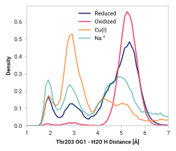

# D004: Thr203 OG1 to H2O

TODO:

## Visualization

## Probability density function

<figure markdown>

</figure>

### Quantitative

--8<-- "study/figures/d-thr203/d004-thr203_og1-h2o_h/pdf-info.md"

## Potential of mean force

<figure markdown>

</figure>

### Quantitative

--8<-- "study/figures/d-thr203/d004-thr203_og1-h2o_h/pmf-info.md"
