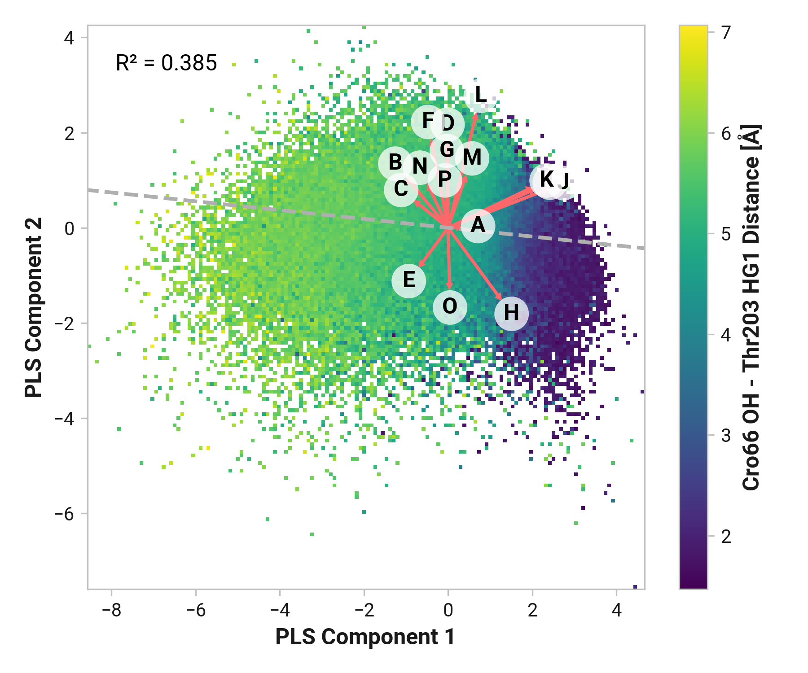

# D005: Cro66 bonding PLS

To investigate the relationship between structural descriptors and the distance between Cro66 OH and His148 HD1, we employed Partial Least Squares (PLS) regression analysis.
This multivariate statistical technique was chosen for its ability to handle high-dimensional, correlated data and reveal underlying patterns in complex datasets.

## Methodology

Dihedral angles were transformed using the function,

$$
\frac{1 - \cos \left(\theta\right)}{2}.
$$

This transformation maps the circular dihedral data to a [0, 1] range, preserving the periodicity while differentiating between cis (0°) and trans (180°) conformations.
All input features ($X$) were standardized using sklearn's StandardScaler to ensure each feature contributes equally to the model.
The distance between Cro66 OH and His148 HD1 ($y$) was used as the response variable without scaling.

A PLS regression model was fitted to $X$ and $y$ using sklearn's `PLSRegression` with two components for each simulation state.
The model's performance was evaluated using the R² score.

## Visualization and Interpretation

Data points were projected onto the space of the first two PLS components.
A 2D histogram was created in this space, with bin colors representing the average response variable value.

Loading vectors for each feature were plotted as arrows in the PLS component space.
The magnitude and direction of these arrows indicate the importance and relationship of each feature to the PLS components.
The magnitude of each feature's loading vector was calculated as the Euclidean norm of its first two PLS components.

A dashed line representing the direction of maximum change in the response variable was added to the plot.
This line, referred to as the derivative line, indicates the direction in the PLS component space along which the distance increases most rapidly.

To quantify how each loading vector aligns with the direction of maximum change, we calculated the sine of the angle between each loading vector and the derivative line.
A sine value close to 0 indicates that the loading is closely aligned with the derivative line (either in the same or opposite direction), while a value close to 1 or -1 indicates that the loading is perpendicular to the derivative line.

Ideally, we want to identify loadings that correlate to the PLS components parallel to the largest distance variance.

=== "Reduced"
    <figure markdown>
    { width=700 }
    </figure>

    --8<-- "study/figures/d-thr203/d005-thr203_hg1-pls/reduced_loading_angles_and_magnitudes.md"

=== "Oxidized"
    <figure markdown>
    { width=700 }
    </figure>

    --8<-- "study/figures/d-thr203/d005-thr203_hg1-pls/oxidized_loading_angles_and_magnitudes.md"

=== "Cu(I)"
    <figure markdown>
    { width=700 }
    </figure>

    --8<-- "study/figures/d-thr203/d005-thr203_hg1-pls/cu_loading_angles_and_magnitudes.md"

In these tables, features are sorted by the absolute value of the sine of the angle, with those closest to 0 appearing at the top.
This ordering highlights the features that are most aligned with the direction of maximum change in the response variable.
The $\sin \left( \theta \right)$ column provides a direct measure of alignment: values close to 0 indicate strong alignment with the derivative line, while values close to 1 or -1 indicate perpendicularity.
The sign of the sine tells us which side of the derivative line the loading is on.

## Comparative Analysis

To compare the influence of structural descriptors across different states:

1.  Loading magnitudes for each feature were compiled across all states (reduced, oxidized, Cu-bound).
2.  Features were sorted based on their median absolute loading magnitude across states.

This analysis allows for the identification of structural descriptors that consistently influence the Cro66 OH - His148 HD1 distance across different protein states, as well as those that show state-specific importance.

???+ example "Feature (i.e., loading) analysis"
    --8<-- "study/figures/d-thr203/d005-thr203_hg1-pls/loadings_analysis.md"

## Visualization

