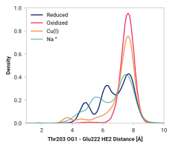
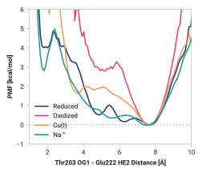

# D007: Thr203 HG1 to Glu222 OE1

## Probability density function

<figure markdown>
{ width=500 }
</figure>

### Quantitative

--8<-- "study/figures/d-thr203/d007-thr203_og1-glu222_he2/pdf-info.md"

## Potential of mean force

<figure markdown>
{ width=500 }
</figure>

### Quantitative

--8<-- "study/figures/d-thr203/d007-thr203_og1-glu222_he2/pmf-info.md"

## Visualization

