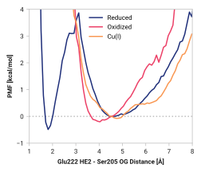

# E001: Ser205 OG - Glu222 HE2

## Probability density function

<figure markdown>

</figure>

### Hydrogen bonding

The following table presents the probability of the hydrogen bonding (within 2.5 Å).

| System | H bond |
| ------ | ------ |
| Reduced | 0.299 |
| Oxidized | 0.000 |
| Cu(I) | 0.000 |

### Quantitative

--8<-- "study/figures/e-proton-wire/e001-ser205_og-glu222_he2/pdf-info.md"

## Potential of mean force

<figure markdown>

</figure>

### Quantitative

--8<-- "study/figures/e-proton-wire/e001-ser205_og-glu222_he2/pmf-info.md"

## Visualization

