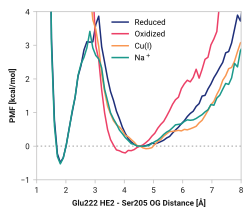

# e001-ser205_og-glu222_he2

TODO:

## Probability density function

<figure markdown>

</figure>

### Quantitative

--8<-- "study/figures/e-proton-wire/e001-ser205_og-glu222_he2/pdf-info.md"

## Potential of mean force

<figure markdown>

</figure>

### Quantitative

--8<-- "study/figures/e-proton-wire/e001-ser205_og-glu222_he2/pmf-info.md"
