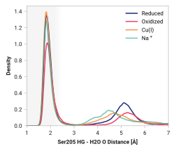
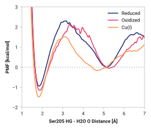

# e002-ser205_hg-h2o_o

TODO:

## Probability density function

<figure markdown>

</figure>

### Quantitative

--8<-- "study/figures/e-proton-wire/e002-ser205_hg-h2o_o/pdf-info.md"

## Potential of mean force

<figure markdown>

</figure>

### Quantitative

--8<-- "study/figures/e-proton-wire/e002-ser205_hg-h2o_o/pmf-info.md"
