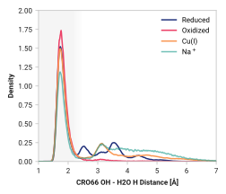

# E003: H2O O - Cro66 OH

## Water detection

The following table presents the probability of either a water molecule was (a) near or (hydrogen bonding) to the chromophore.

| System | Detected | H bond |
| ------ | -------- | ------ |
| Reduced | 0.830 | 0.560 |
| Oxidized | 0.630 | 0.601 |
| Cu(I) | 0.841 | 0.538 |

## Probability density function

<figure markdown>

</figure>

### Quantitative

--8<-- "study/figures/e-proton-wire/e003-cro66_oh-h2o_h/pdf-info.md"

## Potential of mean force

<figure markdown>

</figure>

### Quantitative

--8<-- "study/figures/e-proton-wire/e003-cro66_oh-h2o_h/pmf-info.md"

## Visualization

