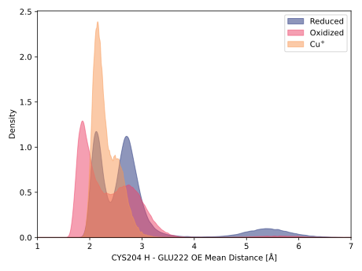
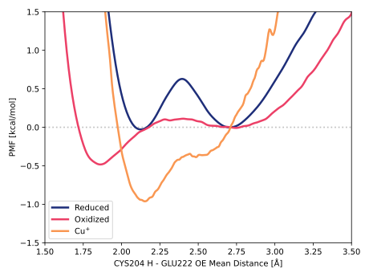

# e005-cys204_h-glu222_oe

TODO:

## Probability density function

<figure markdown>

</figure>

### Quantitative

--8<-- "study/figures/e-proton-wire/e005-cys204_h-glu222_oe/pdf-info.md"

## Potential of mean force

<figure markdown>

</figure>

### Quantitative

--8<-- "study/figures/e-proton-wire/e005-cys204_h-glu222_oe/pmf-info.md"
