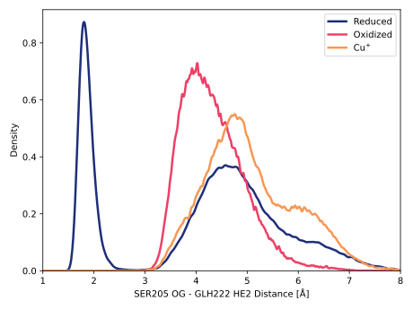
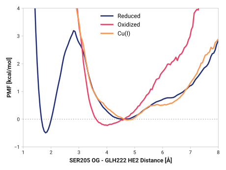

# e008-ser205_og-glh222_he2

TODO:

!!! warning

    Data contained here comes from GLH222 simulations.

!!! quote "Distance"
    

## Probability density function

**Bandwidth**: `0.02`.
Anything higher than this starts distorting the relative heights of the peaks.

<figure markdown>

</figure>

### Quantitative

--8<-- "study/figures/e-proton-wire/e008-ser205_og-glh222_he2/pdf-info.md"

## Potential of mean force

<figure markdown>

</figure>

### Quantitative

--8<-- "study/figures/e-proton-wire/e008-ser205_og-glh222_he2/pmf-info.md"
