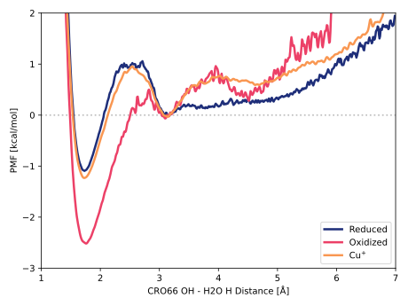

# e009-cro66_oh-h2o_h

TODO:

!!! warning

    Data contained here comes from GLH222 simulations.

## Probability density function

<figure markdown>

</figure>

### Quantitative

--8<-- "study/figures/e-proton-wire/e009-cro66_oh-h2o_h/pdf-info.md"

## Potential of mean force

<figure markdown>

</figure>

### Quantitative

--8<-- "study/figures/e-proton-wire/e009-cro66_oh-h2o_h/pmf-info.md"
