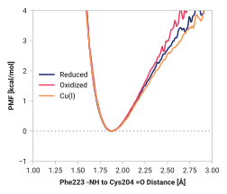

# F003: Phe223 -NH to Cys204 =O

TODO:

## Probability density function

<figure markdown>

</figure>

### Hydrogen bonding

The following table presents the probability of the hydrogen bonding (within 2.5 Å).

| System | H bond |
| ------ | ------ |
| Reduced | 0.994 |
| Oxidized | 0.997 |
| Cu(I) | 0.992 |

### Quantitative

--8<-- "study/figures/f-backbone/f003-cys204_o-phe223_h/pdf-info.md"

## Potential of mean force

<figure markdown>

</figure>

### Quantitative

--8<-- "study/figures/f-backbone/f003-cys204_o-phe223_h/pmf-info.md"

## Visualization

