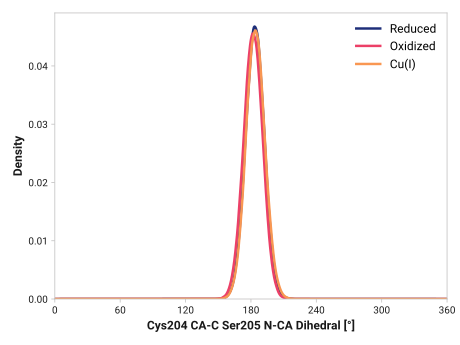
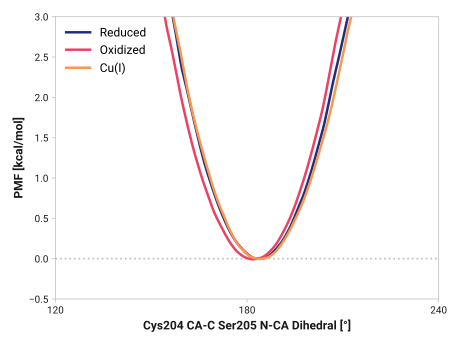

# f002-cys204_ca_c-ser205_n_ca

TODO:

## Probability density function

<figure markdown>

</figure>

### Quantitative

--8<-- "study/figures/f-cys-beta/f002-cys204_ca_c-ser205_n_ca/pdf-info.md"

## Potential of mean force

TODO:

<figure markdown>

</figure>

### Quantitative

--8<-- "study/figures/f-cys-beta/f002-cys204_ca_c-ser205_n_ca/pmf-info.md"
