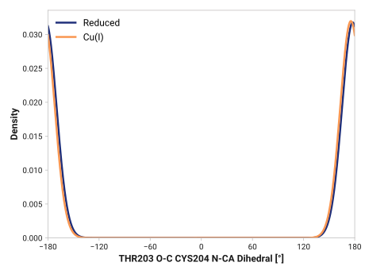
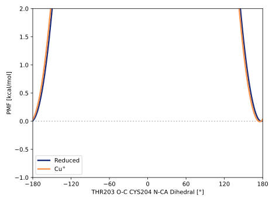

# f007-thr203_o_c-cys204_n_ca

TODO:

## Probability density function

<figure markdown>

</figure>

### Quantitative

--8<-- "study/figures/f-cys-beta/f007-thr203_o_c-cys204_n_ca/pdf-info.md"

## Potential of mean force

TODO:

<figure markdown>

</figure>

### Quantitative

--8<-- "study/figures/f-cys-beta/f007-thr203_o_c-cys204_n_ca/pmf-info.md"
