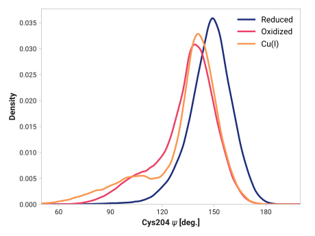
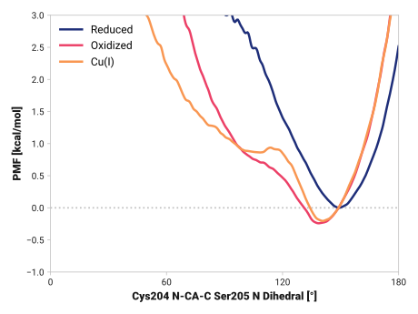

# f009-cys204_n_ca_c-ser205_n

TODO:

## Probability density function

<figure markdown>

</figure>

### Quantitative

--8<-- "study/figures/e-proton-wire/f009-cys204_n_ca_c-ser205_n/pdf-info.md"

## Potential of mean force

<figure markdown>

</figure>

### Quantitative

--8<-- "study/figures/e-proton-wire/f009-cys204_n_ca_c-ser205_n/pmf-info.md"
