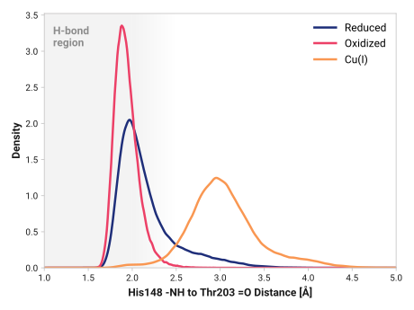
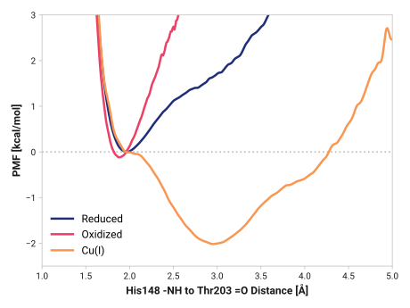

# f010-his148_h-thr203_o

TODO:

## Probability density function

<figure markdown>

</figure>

### Quantitative

--8<-- "study/figures/f-cys-beta/f010-his148_h-thr203_o/pdf-info.md"

## Potential of mean force

<figure markdown>

</figure>

### Quantitative

--8<-- "study/figures/f-cys-beta/f010-his148_h-thr203_o/pmf-info.md"
