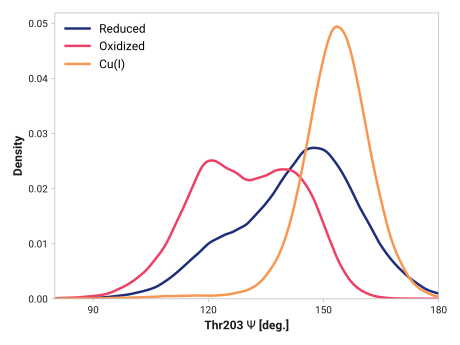
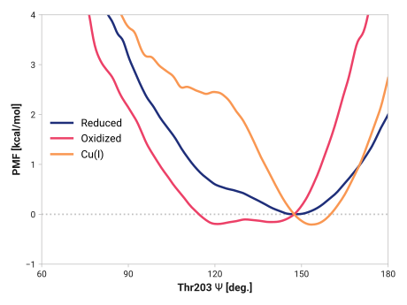

# f011-thr203_n_ca_c-cys204_n

TODO:

## Probability density function

<figure markdown>

</figure>

### Quantitative

--8<-- "study/figures/e-proton-wire/f011-thr203_n_ca_c-cys204_n/pdf-info.md"

## Potential of mean force

<figure markdown>

</figure>

### Quantitative

--8<-- "study/figures/e-proton-wire/f011-thr203_n_ca_c-cys204_n/pmf-info.md"
