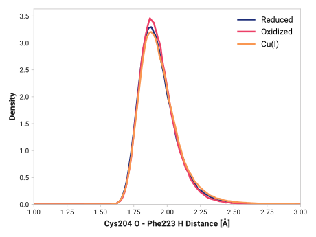

# f012-cys204_o-phe223_h

TODO:

## Probability density function

<figure markdown>

</figure>

### Quantitative

--8<-- "study/figures/f-cys-beta/f012-cys204_o-phe223_h/pdf-info.md"

## Potential of mean force

<figure markdown>

</figure>

### Quantitative

--8<-- "study/figures/f-cys-beta/f012-cys204_o-phe223_h/pmf-info.md"
