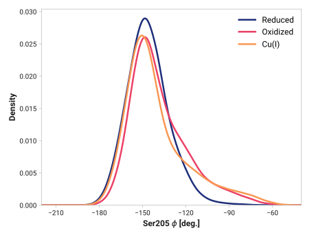
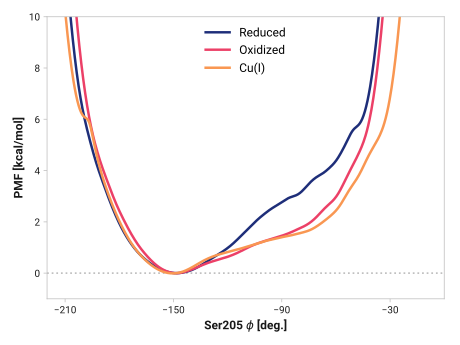

# f013-cys204_c-ser205_n_ca_c

## Probability density function

<figure markdown>

</figure>

### Quantitative

--8<-- "study/figures/f-cys-beta/f013-cys204_c-ser205_n_ca_c/pdf-info.md"

## Potential of mean force

TODO:

<figure markdown>

</figure>

### Quantitative

--8<-- "study/figures/f-cys-beta/f013-cys204_c-ser205_n_ca_c/pmf-info.md"
