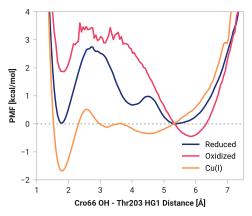

# G010: Cro66 OH to Thr203 HG1

## Probability density function

<figure markdown>

</figure>

### Hydrogen bonding

The following table presents the probability of the hydrogen bonding (within 2.5 Å).

| System | H bond |
| ------ | ------ |
| Reduced | 0.191 |
| Oxidized | 0.009 |
| Cu(I) | 0.619 |

### Quantitative

--8<-- "study/figures/d-thr203/g010-cro66_oh-thr203_hg1/pdf-info.md"

<figure markdown>

</figure>

## Potential of mean force

<figure markdown>

</figure>

### Quantitative

--8<-- "study/figures/d-thr203/g010-cro66_oh-thr203_hg1/pmf-info.md"

## Visualization

