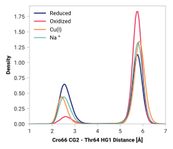

# G012: Cro66 CG2 - Thr64 HG1

## Probability density function

<figure markdown>
{ width=600 }
</figure>

### Hydrogen bonding

The following table presents the probability of the hydrogen bonding (within 2.5 Å).

| System | H bond |
| ------ | ------ |
| Reduced | 0.403 |
| Oxidized | 0.081 |
| Cu(I) | 0.228 |
| Na+ | 0.268 |

### Quantitative

--8<-- "study/figures/g-cro-interact/g012-cro66_og1-thr64_hg1/pdf-info.md"
