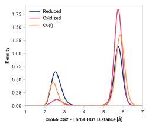

# G012: Cro66 CG2 - Thr64 HG1

## Probability density function

<figure markdown>
{ width=600 }
</figure>

### Hydrogen bonding

The following table presents the probability of the hydrogen bonding (within 2.5 Å).

| System | H bond |
| ------ | ------ |
| Reduced | 0.689 |
| Oxidized | 0.977 |
| Cu(I) | 0.895 |
| Na+ | 0.732 |

### Quantitative

--8<-- "study/figures/b-cro-between/b007-cro66_og1-glu222_he2/pdf-info.md"

## Potential of mean force

<figure markdown>

</figure>

### Quantitative

--8<-- "study/figures/b-cro-between/b007-cro66_og1-glu222_he2/pmf-info.md"

## Visualization

