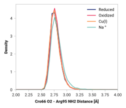

# G014: Cro66 O2 - Arg96 NH2

## Probability density function

<figure markdown>
{ width=600 }
</figure>

### Quantitative

--8<-- "study/figures/g-cro-interact/g014-cro66_o2-arg96_nh2/pdf-info.md"
