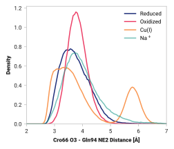

# G017: Cro66 O3 - Gln94 NE2

## Probability density function

<figure markdown>
{ width=600 }
</figure>

### Quantitative

--8<-- "study/figures/g-cro-interact/g017-cro66_o3-gln94_ne2/pdf-info.md"
