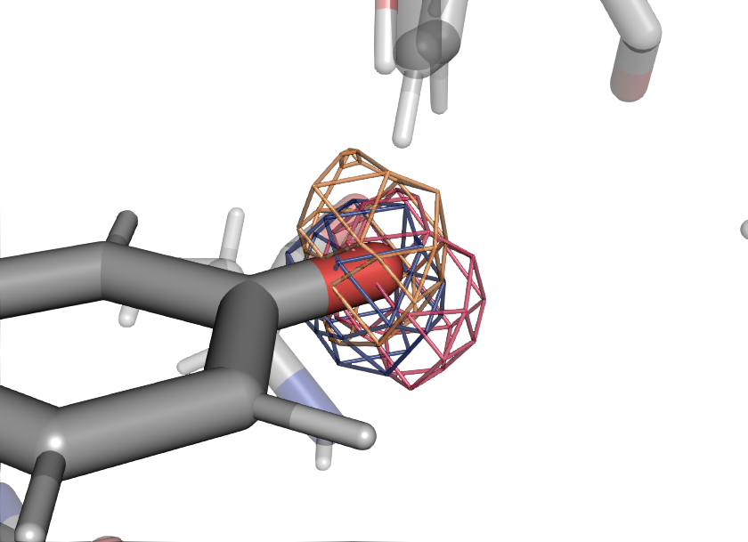
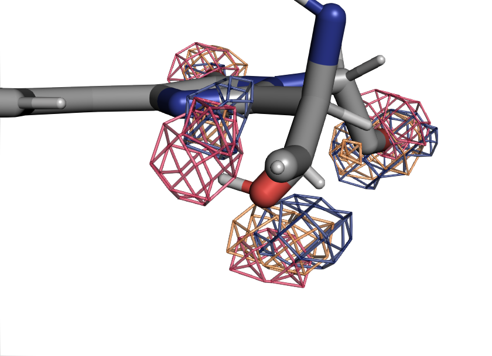
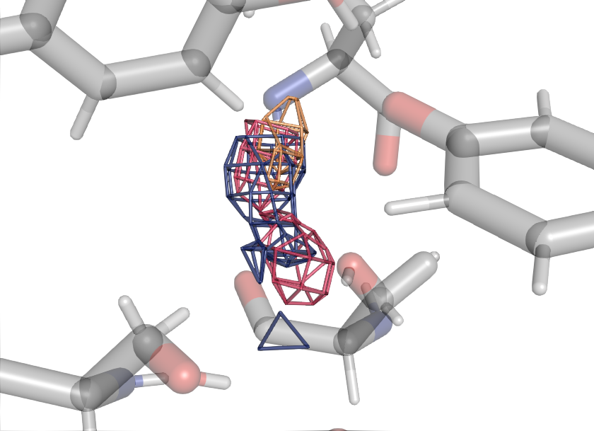
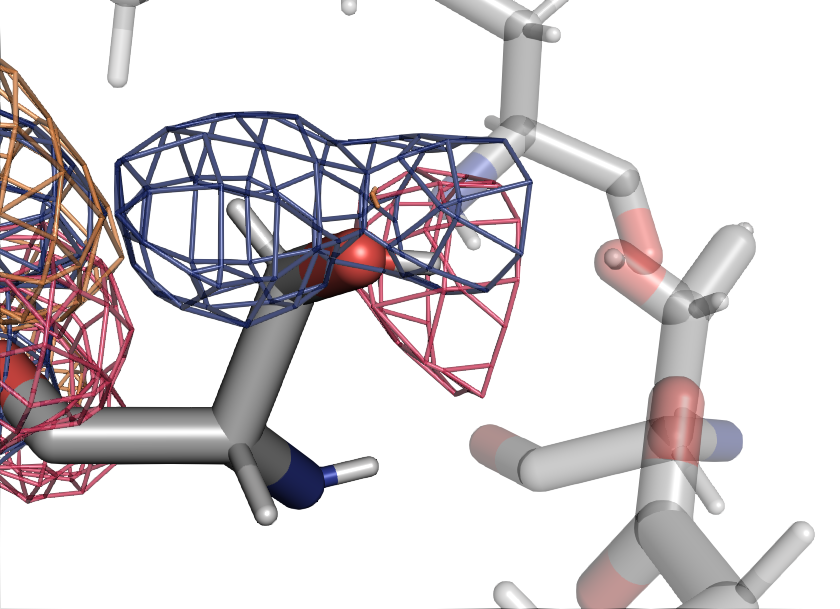
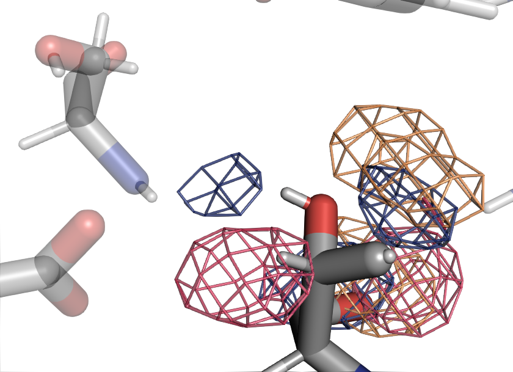
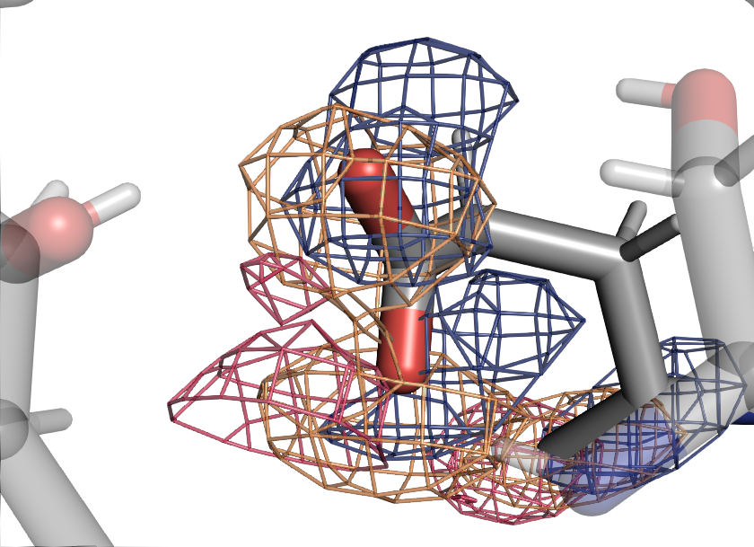

# g002-sdf-o-individual

TODO:

!!! quote "Chromophore"

    <figure markdown>
    
    </figure>

!!! quote "Chromophore"

    <figure markdown>
    
    </figure>

!!! quote "Water"

    <figure markdown>
    
    </figure>

!!! quote "SER205"

    <figure markdown>
    
    </figure>

!!! quote "THR203"

    <figure markdown>
    
    </figure>

!!! quote "GLU222"

    <figure markdown>
    
    </figure>
