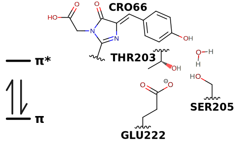
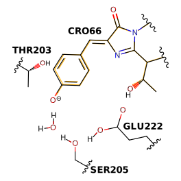
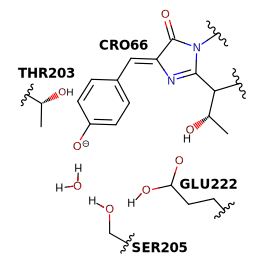
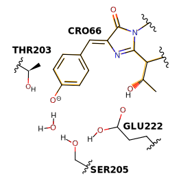

# h004-cro-wire

## Through I state

<figure markdown>
{ width=500 }
</figure>

<figure markdown>
{ width=500 }
</figure>

<figure markdown>
{ width=500 }
</figure>

<figure markdown>
{ width=500 }
</figure>

## Through B state

<figure markdown>
{ width=500 }
</figure>

<figure markdown>
{ width=500 }
</figure>

<figure markdown>
{ width=500 }
</figure>

<figure markdown>
{ width=500 }
</figure>
